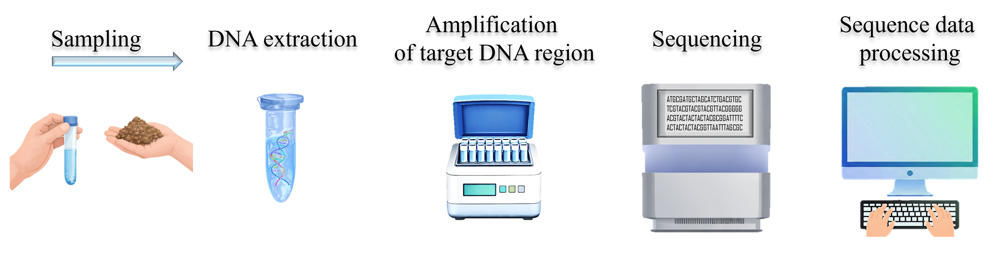

.. |eufund| image:: _static/eu_co-funded.png
  :width: 200
  :alt: Alternative text

.. |chfund| image:: _static/ch-logo-200x50.png
  :width: 210
  :alt: Alternative text

.. |ukrifund| image:: _static/ukri-logo-200x59.png
  :width: 150
  :alt: Alternative text

.. |logo_BGE_small| image:: _static/logo_BGE_alpha.png
  :width: 120
  :alt: Alternative text
  :target: https://biodiversitygenomics.eu/

.. raw:: html

    

.. role:: red

What is a metabarcoding workflow?
*********************************

Metabarcoding is a high-throughput molecular approach used to assess biodiversity by analyzing environmental DNA (eDNA) or bulk DNA samples. 
The workflow is composed of several key steps:

|metabarcoding_workflow|

**The typical metabarcoding workflow consists of:**

1. **Sample collection**
   
   - Environmental or bulk samples are collected from water, soil, sediment, traps (e.g., Malaise traps) or other sources.

2. **DNA extraction**
   
   - DNA is extracted from the samples using appropriate methods for the matrix.

3. **Target DNA region amplification**
   
   - Target gene regions (known as markers, e.g., 16S, 18S, ITS, COI) are amplified using specific primers.
   - PCR introduces exponential amplification, with some variation in efficiency across taxa.

4. **DNA library preparation and sequencing**
   
   - PCR products are prepared for sequencing and sequenced using high-throughput sequencing platforms.

5. **Sequence data processing (bioinformatics)**

   - During bioinformatics processing, unreliable and off-target sequences are removed, grouped into metabarcoding features: Amplicon Sequence Variants (ASVs) and/or clustered into Operational Taxonomic Units (OTUs).
   - Metabarcoding features are matched to a reference database to assign taxonomic identities.
  
|
| Standard output of a full metabarcoding workflow is a metabarcoding feature table by sample matrix with sequence abundances accompanied by taxonomic information table.

**Metabarcoding feature table by sample matrix with sequence abundances:**

+------------+---------+---------+---------+----------------+-----+
|            | sample1 | sample2 | sample3 | :red:`control` | ... |
+------------+---------+---------+---------+----------------+-----+
| **OTU_01** | 4290    | 40550   | 3902    | 0              | ... |
+------------+---------+---------+---------+----------------+-----+
| **OTU_02** | 550     | 34501   | 2       | 0              | ... |
+------------+---------+---------+---------+----------------+-----+
| **OTU_03** | 2010    | 110     | 0       | :red:`1306`    | ... |
+------------+---------+---------+---------+----------------+-----+
| **OTU_04** | 3061    | 0       | 3465    | :red:`1`       | ... |
+------------+---------+---------+---------+----------------+-----+
| ...        | ...     | ...     | ...     | ...            | ... |
+------------+---------+---------+---------+----------------+-----+

**Taxonomy table:**

+------------+-----+----------------+---------------+------------------+---------------------+
|            | ... | Order          | Family        | Genus            | species             |
+------------+-----+----------------+---------------+------------------+---------------------+
| **OTU_01** | ... | Lepidoptera    | Nymphalidae   | Aglais           | Aglais urticae      |
+------------+-----+----------------+---------------+------------------+---------------------+
| **OTU_02** | ... | Lepidoptera    | Nymphalidae   | Genus_0022       | Genus_0022_sp       |
+------------+-----+----------------+---------------+------------------+---------------------+
| **OTU_03** | ... | Carnivora      | Felidae       | Felis            | Felis catus         |
+------------+-----+----------------+---------------+------------------+---------------------+
| **OTU_04** | ... | Sarcoptiformes | Pyroglyphidae | Dermatophagoides | Dermatophagoides_sp |
+------------+-----+----------------+---------------+------------------+---------------------+
| ...        | ... | ...            | ...           | ...              | ...                 |
+------------+-----+----------------+---------------+------------------+---------------------+

Reading the outputs
===================

.. important:: 

  All that is outputted by the bioinformatics pipeline **may not be "gold"**.
  The quality of the final data is dependent on the quality of the full metabarcoding workflow, but there 
  are also some inherent limitations that should be considered when interpreting species occurrences and abundances.

In the example metabarcoding feature table (OTU table), we can see that:

- **OTU_01** is present in all samples (except the control sample) with varying abundances.
  In the taxonomy table, OTU_01 corresponds to Aglais urticae (butterfly, small tortoiseshell). 
  It is highly likeley that this butterfly represents a real occurrence in the samples.
  
- **OTU_02** is present in sample2 with 34501 sequences, but **only with 2 sequences in sample3**. 
  It is likely that this OTU is present in the sample2, but it is uncertain whether it is also really present in sample3. 
  It is possible that the PCR reaction in sample3 may not have been efficient for that specific taxon and/or the 
  sequencing depth (number of sequenced reads per sample) may not have been sufficient, therefore the sequence abundance is low for OTU_02 in sample3.
  On the other hand, the 2 sequences in sample3 may be **artificial** (i.e., not real occurrence), since they may represent so called "tag-jump" errors (from sample2) where few sequences 
  have been assigned to wrong sample. The tag-jump errors are relatively common in metabarcoding data, 
  but can be evaluated and removed by bioinformatic filtering steps (see e.g. :ref:`tagjumpsCOI` section here). 
  **Without multiple biological or technical sample replicates, it is difficult to assess if OTU_02 is really present in sample3 or not**; 
  therefore it is "safer" to consider it as **absent** in sample3.

  In the taxonomy table, OTU_02 corresponds to **Genus_0022_sp**, which means that genus and species level identification was not possible with the reference database used.
  However, the taxonomy assignment was confident that this OTU belong to butterfly family Nymphalidae. Higher taxonomic level identifications are 
  also common in metabarcoding data, since the **reference database may not be complete for all taxa**. 
  
- **OTU_03** is present in sample1 and sample2, but is also relatively abundant in the :red:`control` sample.
  The :red:`control sample` is used to assess potential contamination of the metabarcoding workflow. 
  The control sample can represent blank DNA extraction (i.e., no sample substrate added to DNA extraction tubes) and/or blank PCR reaction (i.e., no reaction with template DNA). 
  Therefore, in theory, the control sample should not contain any reads assigned to it. 
  But in reality, it is not uncommon to observe some reads assigned to the control sample.
  This can be due to contamination of the lab chemicals and/or contamination of the sample during handiling the samples.

  Since, OTU_03 is abundant in the control sample, it likely represents a contamination rather than a real occurrence is samples 1 and 2. 
  From the taxonomy table above, we can see that OTU_03 is assigned to **Felis catus (domestic cat)**, thus likely  
  representing contamination from clothing or personal items during handiling the samples. 

  :red:`This contaminant OTU (species) should be excluded from the further analysis.`
  It is not always easy to manually identify and remove contaminant OTUs. 
  Here, tools such as `decontam <https://github.com/benjjneb/decontam>`_ can be very helpful to automatically identify and remove contaminants (see :ref:`remove_contaminants` section).
   
- **OTU_04** is present in samples 1 and 3 with a sequence abundance of 201 and 3465 respectively, but also in the :red:`control` sample with 1 sequence.
  This OTU is assigned to dust mite genus (Dermatophagoides), which could be a potential contaminant from dust,
  but it's sequence abundance is minimal in the control sample. Therefore, it is likely a tag-jump error in the control samples and 
  real occurrence in samples 1 and 3.
  

___________________________________________________

Sequence abundance ≠ biological abundance
=========================================

Metabarcoding data is **compositional**, meaning that sequence abundances reflect relative contributions within a sample (ratios among taxa), not absolute quantities.

Sequence counts are influenced by multiple factors beyond true biological abundance, thus if 
OTU_01 has 40,550 sequences in sample2 but only 4,290 sequences in sample1, we cannot conclude (without additional information) that OTU_01 
(that is, small tortoiseshell butterfly) was more abundant is our sampling location where sample2 was collected. 
From a compositional perspective, OTU_01 did not change in dominance relative to the rest of the community (OTUs) in both samples. 

If the focus is on species occurrences, then **presence/absence data can be used**.  

**Presence/absence feature table:**

+------------+---------+---------+----------+-----+
|            | sample1 | sample2 | sample3  | ... |
+------------+---------+---------+----------+-----+
| **OTU_01** | 1       | 1       | 1        | ... |
+------------+---------+---------+----------+-----+
| **OTU_02** | 1       | 1       | :red:`0` | ... |
+------------+---------+---------+----------+-----+
| **OTU_04** | 1       | 0       | 1        | ... |
+------------+---------+---------+----------+-----+
| ...        | ...     | ...     | ...      | ... |
+------------+---------+---------+----------+-----+

However, prior transforming the sequence abundance data to presence/absence data, appropriate filtering steps (e.g., tag-jump 
removal, minimum read count thresholds) should be applied to distinguish likely biological signals from technical artifacts.
Here, note that in the feature table above (sequence abundance table), **OTU_02 is present in sample3, but removed in 
presence/absence table because it was likely a tag-jump error**. 

Filtering based on the **minimum read count thresholds** can be appied to remove OTUs with low sequence abundances
(which would remove also tag-jump errors as they occur with low abundances). Minimum read count thresholds should 
be applied per sample because sequence count of 5 per OTU in a sample with total of 500,000 sequences is not the same as 
in a sample with total of 50,000 sequences. **Applying the same threshold across all samples ignores this context.**
Here, let's say that our sequence abundance fitering threshold per sample is **0.001%** of the total sequences in the sample. 
So, the OTU with 5 sequences in a sample with total of 50,000 sequences would be kept because 
it has more than 0.001% [100*(5/50000) = 0.01%] of the total sequences in the sample. 
But the OTU with 5 sequences in a sample with total of 500,000 sequences would be removed because 
it falls within the threshold of 0.001% [100*(5/500000) = 0.001%] of the total sequences in the sample.
If we used a global threshold (e.g., keep OTUs with ≥5 reads across all samples), we may count spurious OTUs in very deeply sequenced samples and/or 
miss real OTUs in low-depth samples. 

____________________________________________________

Taxonomic assignments
=====================

Taxonomic assignment of features (OTUs/ASVs) relies on comparing feature sequences to a reference database. 
The accuracy and resolution of these assignments **depend heavily on the quality and taxonomic coverage of the reference database used**.

If a taxon is missing from the reference database, an OTU may only be assigned to a higher taxonomic level 
(e.g., family or order) or may remain unassigned. 
Similarly, errors or mislabeled records in the database can lead to incorrect assignments. 

Metabarcoding is not perfect 
============================

There are some inherent limitations in metabarcoding that should be considered when interpreting the results.
This method is not perfect, just like any other method for species identification. 
However, metabarcoding offers a **cost-effective and time-efficient approach** for processing large numbers of samples, particularly in biodiversity surveys. 
The method relies on reference sequence databases that are built from specimens identified 
using morphological (or integrative) taxonomy, which is the most time-consuming step in traditional biodiversity assessments. 
Once reference sequences are established, metabarcoding enables rapid and standardized taxonomic assignment across many samples, 
including by non-taxonomists, thereby greatly increasing the scalability and reproducibility of biodiversity analyses.
Additionally, for many microbial groups, where morphological identification is impractical or impossible, 
metabarcoding represent the most feasible method for large-scale biodiversity assessment.

____________________________________________________

|logo_BGE_small| |eufund| |chfund| |ukrifund|
