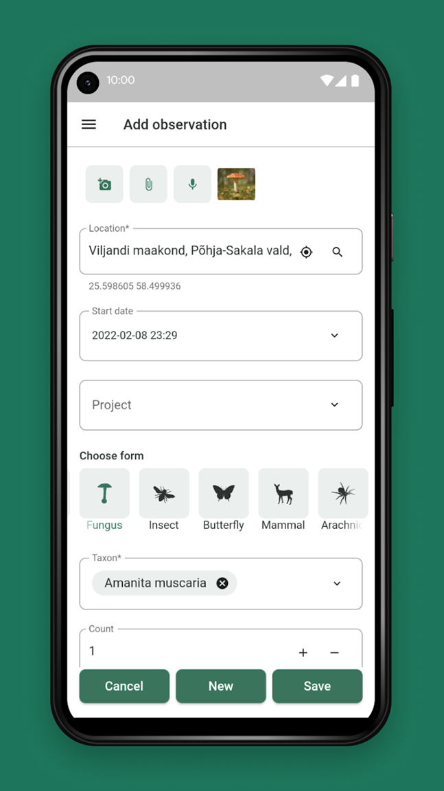
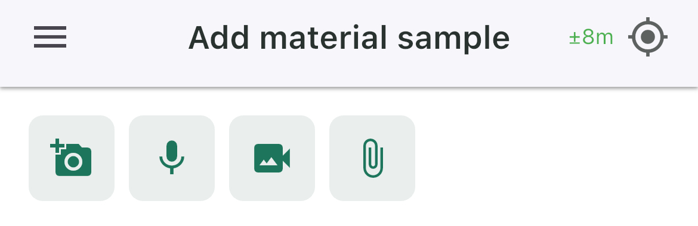
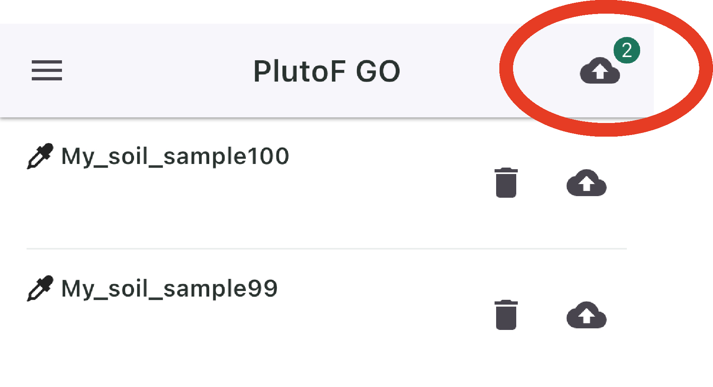
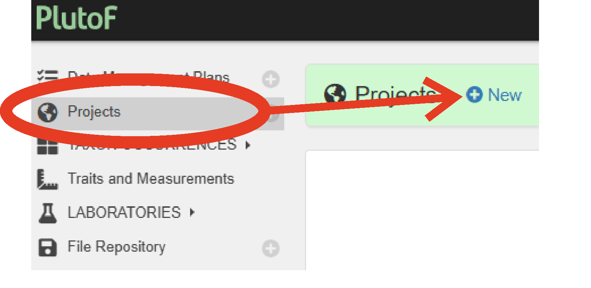
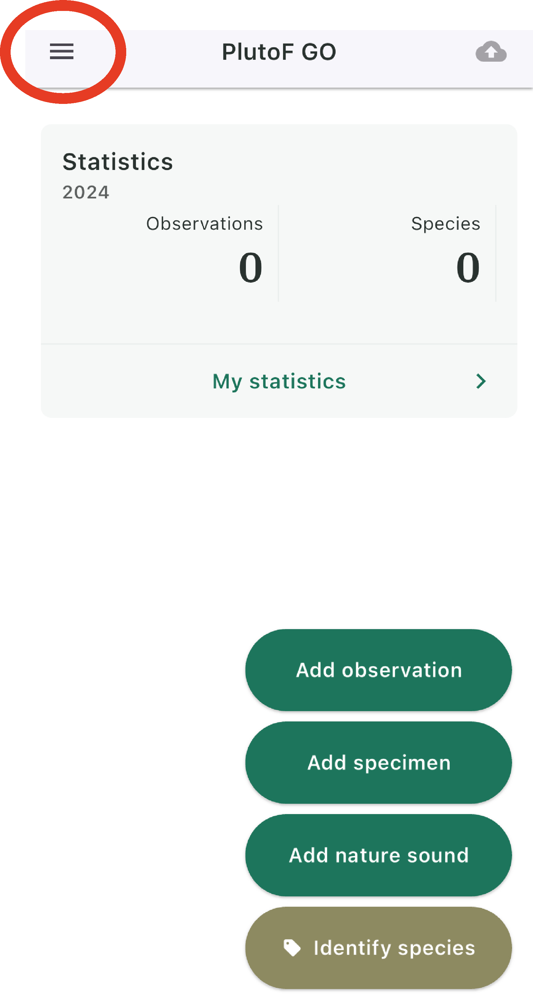
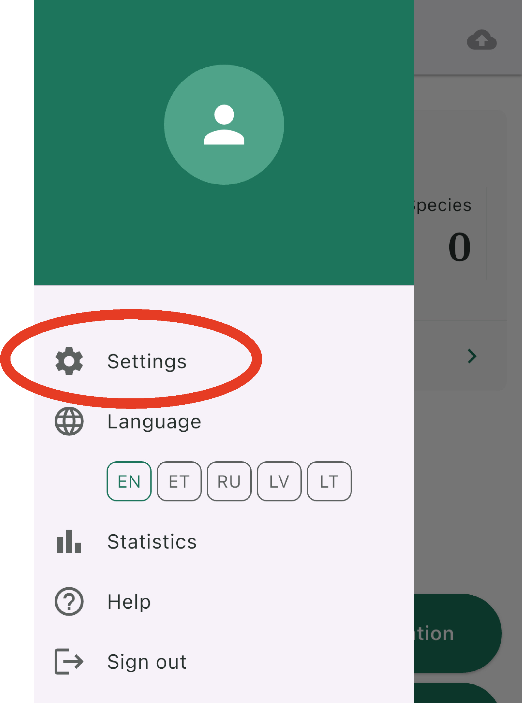
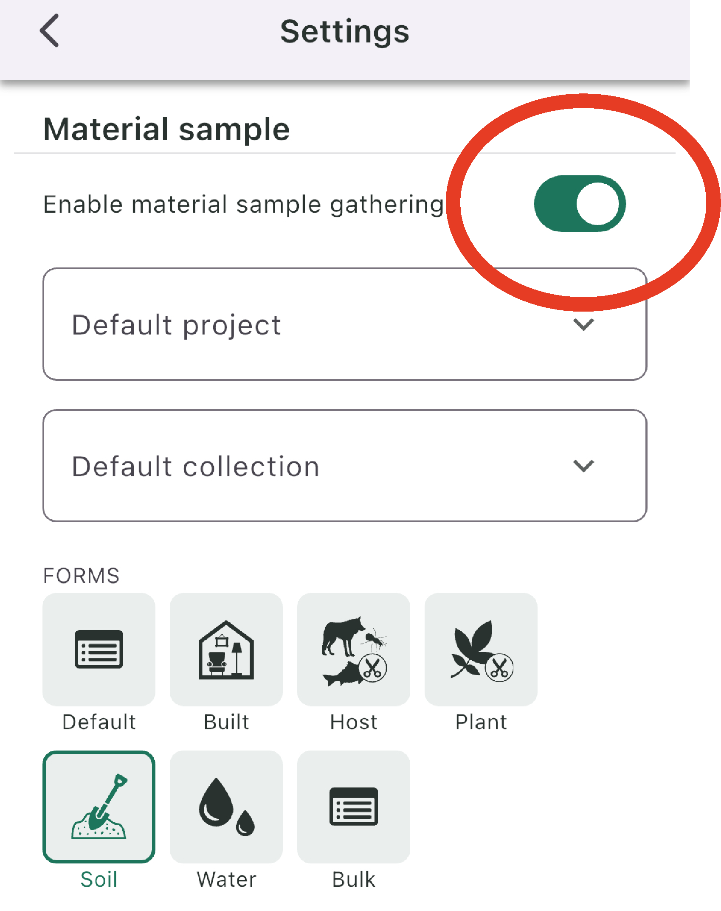
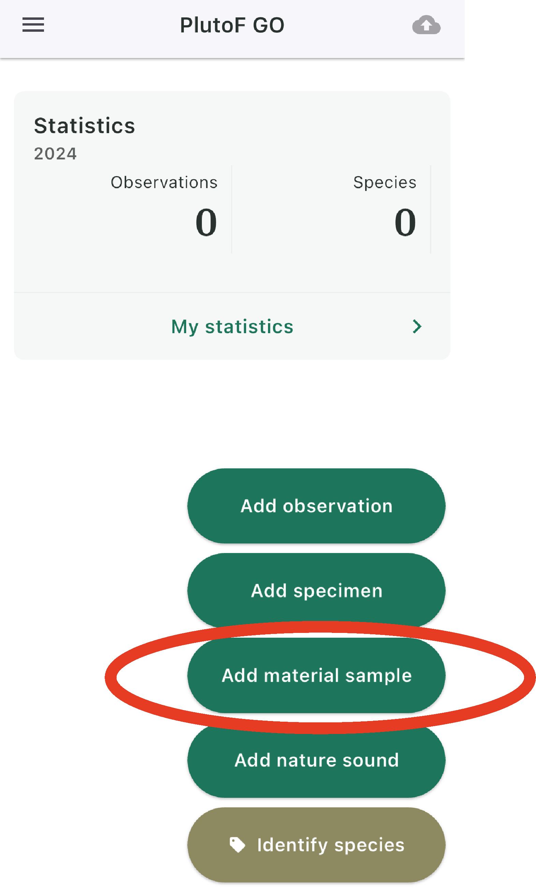

.. |logo_BGE_alpha| image:: _static/logo_BGE_alpha.png
  :width: 300
  :alt: Alternative text
  :target: https://biodiversitygenomics.eu/

.. |eufund| image:: _static/eu_co-funded.png
  :width: 200
  :alt: Alternative text

.. |chfund| image:: _static/ch-logo-200x50.png
  :width: 210
  :alt: Alternative text

.. |ukrifund| image:: _static/ukri-logo-200x59.png
  :width: 150
  :alt: Alternative text

.. |logo_BGE_small| image:: _static/logo_BGE_alpha.png
  :width: 120
  :alt: Alternative text
  :target: https://biodiversitygenomics.eu/

.. raw:: html

    

.. role:: red

.. |arrow| raw:: html

   &#8594;
  
.. |arrow_down| raw:: html

   &#8595;

|logo_BGE_alpha|

.. _registering_samples_in_plutof:

Registering samples in PlutoF GO 
********************************

`PlutoF GO <https://plutof.ut.ee/go>`_ is data collection tool for biodiversity data - observations, specimens, material samples.
A handy **phone application** that can be used to record samples during fieldwork.
The collected data is stored in `PlutoF Biodiversity Data Management Platform <https://plutof.ut.ee/en>`_. 

|plutoFgo_phone|

.. admonition:: Getting started
  
  | Before using the app, `become a user <https://app.plutof.ut.ee/register>`_ in the `PlutoF website <https://plutof.ut.ee/en>`_.
  | **Registering samples in PlutoF GO requires a Project ID**. Generate one if needed in `PlutoF <https://plutof.ut.ee/en>`_.

|new_project|

____________________________________________________

Add samples
-----------

| **This is an example how to add 'material sample' to PlutoF data management platform.**
|     *Material samples are for example soil, water, malaise trap samples.*

.. admonition:: Open PlutoF GO

  **1.** Open the PlutoF GO application on your phone/tablet, 
     and enable material sample gathering through 'Settings'. 

|to_settings| |arrow| |settings| |arrow| |enable_material_sample| 

``Add material sample`` is now displayed on the main screen.           

|material_sample_tab|

.. admonition:: Add material sample
  
  | **2.** Go to ``Add material sample``. 
  | GPS coordinates are captured automatically (but can be edited in the ``Location`` box)

.. admonition:: Choose Project (mandatory)
  
  | **3.** Choose Project by typing in your Project ID.
  | Project ID where the recorded samples are **allocated by default** can be added in via 'Settings'.
  | GPS coordinates are captured automatically (but can be edited in the ``Location`` box)

.. admonition:: Add Sample ID (mandatory)
  
  | **4.** Add Sample ID or scan the `QR-code of a pre-registered sample <https://www.youtube.com/watch?v=1My4Vn10YkA>`_.

.. admonition:: Fill other optional fields
  
  | **5.** Fill other optional fields and ``save`` the record. 

Note that **images, videos, audio and other sample associated files** can be also added.

|multimedia| 

.. admonition:: Upload 
  
  | **6.** Upload samples to PlutoF
  | After pushing ``save`` the records are only **locally saved**; and can be edited. 
  | **Press the cloud icon** on the top right corner to export records to PlutoF platform. 

| |upload|
| Once the records are in PlutoF, they can be further edited only in `PlutoF web platform <https://plutof.ut.ee/en>`_.

___________________________________________________

|logo_BGE_small| |eufund| |chfund| |ukrifund|
