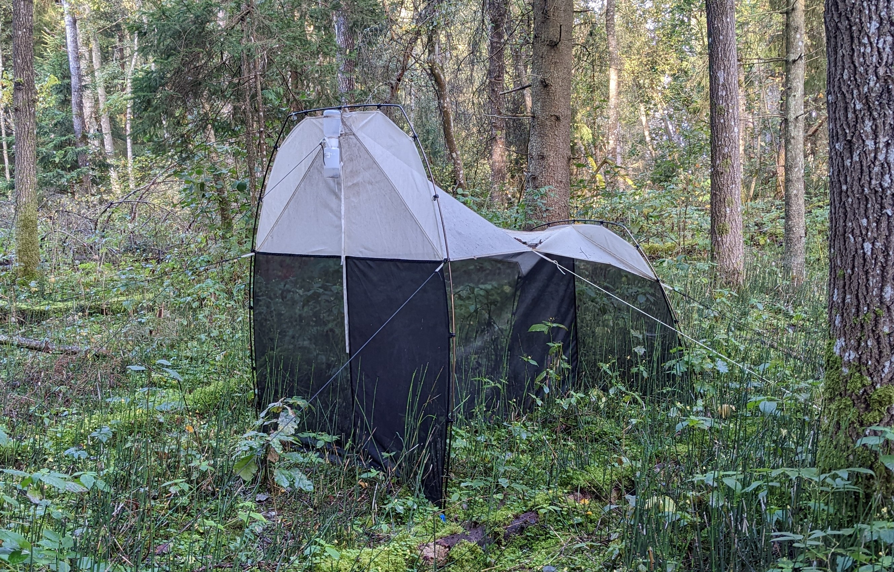
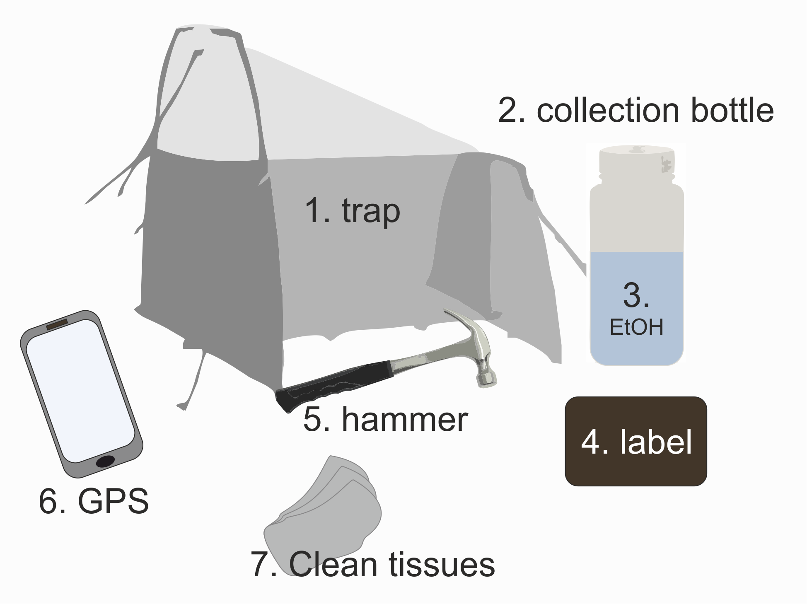

.. |logo_BGE_alpha| image:: _static/logo_BGE_alpha.png
  :width: 300
  :alt: Alternative text
  :target: https://biodiversitygenomics.eu/

.. |eufund| image:: _static/eu_co-funded.png
  :width: 200
  :alt: Alternative text

.. |chfund| image:: _static/ch-logo-200x50.png
  :width: 210
  :alt: Alternative text

.. |ukrifund| image:: _static/ukri-logo-200x59.png
  :width: 150
  :alt: Alternative text

.. |logo_BGE_small| image:: _static/logo_BGE_alpha.png
  :width: 120
  :alt: Alternative text
  :target: https://biodiversitygenomics.eu/

.. raw:: html

    

.. role:: red

|logo_BGE_alpha|

Malaise trap 
************

Used for **trapping arhtropods** (mostly flying insects). 

The following guidelines provide instructions for Malaise trap sampling  
used in the `Biodiversity Genomics Europe <https://biodiversitygenomics.eu/>`_ project
to identfy species in the bulk arthropod samples. 
Herein, **Townes style Malaise traps with a white roof** are used. 

|malaise_trap|
*Townes style Malaise trap with a white roof. Click on the image to open Malaise trap set up instructions video link [at youtube].*

___________________________________________________

List of equipment
~~~~~~~~~~~~~~~~~

#.	Malaise trap (including extra set-up cords and pegs)
#.	500 mL sterile collection bottle (`'Wide-Mouth LDPE Bottles with Closure' <https://www.fishersci.no/shop/products/nalgene-wide-mouth-ldpe-bottles-closure/10116230?emb_id=pp_euorderconfirmation_producttitle>`_)
#.	96% or stronger ethanol (EtOH), **not** denatured (to ensure good DNA preservation)
#.	Labels for the samples (collection bottles), and the means to fix the lable (e.g. transparent tape)
#.	Hammer (*may be needed for fixing the trap with pegs*)
#.  Device with a global positioning system (GPS)
#.  *Optional: tissues (paper-towels) to wipe the trap head from dead arthropods when chaning the collection bottle (when temporal patterns are of interest).*

|Malaise_trap_equipment|

___________________________________________________

General considerations
~~~~~~~~~~~~~~~~~~~~~~

**Trap characteristics.** There are different models of Malaise traps available, 
but the most commonly used is the Townes style Malaise trap. It is needed to standardize the trap type
used across sites within a project, as different trap types may have different collection efficiencies for different arthropod groups 

**Remove grid from trap.** Some models include plastic grids/filters that prevent larger arthropods to fall in the trap. In order to sample all arthropod groups, the grid should be removed.

**Sample labels** Preparing a robust labelling system is essential to avoid sample misidentification and 
loss of metadata. It will improve the speed of processing samples on-site and in the lab. Labels can be generated 
prior fieldwork, using individual QR codes (:ref:`See Register samples in PlutoF <registering_samples_in_plutof>`), waterproof paper and ink, or printed on regular paper and laminated.

___________________________________________________

First time set-up
~~~~~~~~~~~~~~~~~~

1. Select a suitable spot (see :ref:`below, 'Placement of the Malaise trap' <placement>`).
2. Set up the trap (see video below; instructions provided also in the `Malaise trapping SOPs <https://workflowhub.eu/sops/17>`_ (Najera-Cortazar et al., 2024))

.. youtube:: sU9rW71f5ZA

|

3. Attach the collecion bottle to the trap.
4. Make sure to store the bottle lid in a way it will not be contaminated (store in e.g. clean zip-lock bag).
5. Let the trap do its job.

___________________________________________________

.. _placement:

Placement of the Malaise trap
~~~~~~~~~~~~~~~~~~~~~~~~~~~~~

:red:`Placement of the Malaise trap is important`; this affects the the collection efficiency.
Herein quoting Gressitt and Gressitt (1962): 
it should be set up where insect flight tends to be concentrated by 
local circumstances of topography, density or lack of vegetation, 
relation to wind, water and such aspects. Suitable places are across 
a small stream or gully, across a wide trail in the forest, 
at a low pass on a ridge, be tween two types of vegetation, 
in a clearing, plantation or savanna woodland at right angles to 
edge of adjoining dense rain forest, or at an opening to 
a clearing. 
The collecting head should always be in the sun (van Achterberg, 2009).

For own consideration: see
`Uhler et al., 2022, A comparison of different Malaise trap types <https://doi.org/10.1111/icad.12604>`_
for the variability in different groups of arthropods trapping efficiency between **different types of Malaise traps**.

____________________________________________________

Before sampling
~~~~~~~~~~~~~~~

Fill the collection bottle with **96% ethanol**, ~300 ml 
(but may be less depending on the expected biomass of arthropods, collection time and evaporation potential);
and fix the label to collection bottle (if applicable).

Collecting samples
~~~~~~~~~~~~~~~~~~

#. Collect the collection bottle
#. Add more ethanol (if needed) to ensure **all individuals are submerged**, and attach the lid
#. If placing a new collection bottle, then use a clean paper tissue to **clean the trap head** to remove dead arthropods
#. The specimens in ethanol may be preserved at room temperature, avoiding light exposure (but -20˚ C is advisable for long term storage).

____________________________________________________

**References**

Gressitt, J. L., & Gressitt, M. K. (1962). 
An improved Malaise trap. Pacific insects, 4(1), 87-90.

Najera-Cortazar, L., Ferreira, S., Mata, V., & Beja, P. (2024).
Biodiversity Genomics Europe | High Mountain Systems - Arthropod sampling with Malaise traps. WorkflowHub. https://doi.org/10.48546/WORKFLOWHUB.SOP.17.3 

van Achterberg, K. (2009). 
Can Townes type Malaise traps be improved? Some recent developments. Entomologische berichten, 69(4), 129-135.

Uhler, J., Haase, P., Hoffmann, L., Hothorn, T., Schmidl, J., Stoll, S., ... & Müller, J. (2022). 
A comparison of different Malaise trap types. Insect Conservation and Diversity, 15(6), 666-672.

____________________________________________________

|logo_BGE_small| |eufund| |chfund| |ukrifund|
