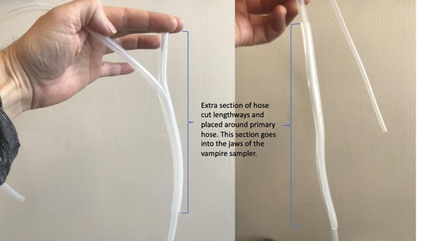
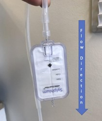

.. |logo_BGE_alpha| image:: _static/logo_BGE_alpha.png
  :width: 300
  :alt: Alternative text
  :target: https://biodiversitygenomics.eu/

.. |eufund| image:: _static/eu_co-funded.png
  :width: 200
  :alt: Alternative text

.. |chfund| image:: _static/ch-logo-200x50.png
  :width: 210
  :alt: Alternative text

.. |ukrifund| image:: _static/ukri-logo-200x59.png
  :width: 150
  :alt: Alternative text

.. |logo_BGE_small| image:: _static/logo_BGE_alpha.png
  :width: 120
  :alt: Alternative text
  :target: https://biodiversitygenomics.eu/

.. raw:: html

    

.. role:: red

|logo_BGE_alpha|

.. _sampling_water:

Water
******
Water sampling with vampire sampler
===================================

These guidelines provide instructions for aquatic eDNA sampling and analyses 
used in the `Biodiversity Genomics Europe <https://biodiversitygenomics.eu/>`_ project
to detect **marine invasive species** in harbros via collecting water eDNA with **vampire sampler**.

___________________________________________________

List of equipment
~~~~~~~~~~~~~~~~~

(for 1 sample)

#. Vampire sampler with battery fully charged
#. water filter
#. 4.1 m clean tubing (or tubing length dictated by the needs of each sampling site) with luer filter adapter. Sterilize with 10% bleach, rinse well with distilled water before going to the field, tie a small inert weight (e.g. plastic coated fishing sinker) to near the intake end of each hose with some fishing twine etc
#. 50 ml syringe(s)
#. 3.5 ml of Qiagen ATL buffer in a 5 ml syringe, capped with red luer lock cap (must be prepared before going to the field)
#. nitrile gloves
#. clean zip-lock plastic bags
#. Optional: 2 x 3 L container, one filled with 10% bleach (needed if field sterilization of sampling hose between sampling locations is needed) 
#. Bucket with measuring scale, kitchen measuring flask etc to measure the volume of the filtrate 
#. Clear tape
#. One liter of MilliQ ultra-pure water in a 10% bleach pre-sterilized and rinsed container 
  

Before sampling
~~~~~~~~~~~~~~~

Test the functionality of the vampire sampler before entering the field by examining 
the pressure of the pumped output. If the output pressure is weak, cut a 30 cm length 
of silicon hose down its length. This hose can be placed around the section of hose that 
will be fitted into the vampire sampler jaws, providing the necessary pressure against the 
vampire sampler pump wheels to give good output pressure (See figure below).

|testVamp|
*Preparing the section of the hose that goes into the
vampire sampler to achieve the required pressure for water filtering*

You should check the location and each sampling site before the first sampling occasion. 
This will allow you to assess any special considerations for each site 
(i.e. the length of sampling hose required, whether it is in too close proximity to 
large freshwater outlets such as storm drains, etc).

**Sterilize tubes** (#3 item on 'List of equipment') with 10% bleach, 
rinse well with distilled water before going to the field, 
tie a small inert weight (e.g. plastic coated fishing sinker) 
to near the intake end of each hose with some fishing twine etc.

In the field
~~~~~~~~~~~~

At the first sampling site:

* Put on nitrile gloves!
* Place the sampling hose into the mouth of the vampire sampler - use
  the section of the hose pre-prepared with extra hose diameter if
  required. Place the intake end into the water to be sampled and make
  sure the hose end remains submerged.
* Make sure to avoid any contamination of your sampling site (e.g., do
  not enter the water, avoid sampling at location if there are organic
  matter than potentially can influence the sample negatively (dead
  birds, fish, etc.))
* Connect filter to the hose at the filter entry end, (see Fig. 2) -
  **Important!:** make sure the water flows in the direction of the
  arrow

|VampFlow| 

*It is essential that the sampling hose is 
connected to the correct end and the flow of the
filtered water is as indicated by the
arrow in the filter*

* Sample 3 liters of water from roughly 50 cm below the surface trying
  to avoid surface debris and substances that can clog the filter.
  Maintain a steady flow from the filter without using excessive drill
  speed. Use a measuring flask/bucket to measure how much water has
  passed the filter
* After achieving 3L filtered, dry the filter by lifting the sampling
  hose intake from the water and running air through it using the
  vampire sampler at high speed
* Disconnect the filter from the sampling hose
* Connect the 50 ml syringe to the entry end (the end closest to the
  arrow) and push air through the filter to remove excess water. Repeat
  2 times.
* Place one of the two blue luer lock caps on the filter OUTAKE
  (the end furthest from the arrow)
* Add 3,5 ml ATL buffer to the filter using the provided syringe
  (**Important!:** add buffer to the INTAKE end - the end closest to the
  arrow), by plunging the syringe all the way down. Release the syringe
  plunger, letting the back-pressure raise the syringe plunger and you
  will notice at the same time the buffer covering the filtered
  membrane. Allow the back pressure to fully release so the membrane is
  completely covered by buffer before removing the 5ml buffer syringe.
* Close filter housing with the second supplied blue luer lock cap
* Place filter in clean plastic bag (one for each of the five sites in
  your locality)
* Repeat for two additional samples so that there are in total three
  biological replicates from per site
* Ensure that all metadata for the sampling event is stored (:ref:`in PlutoF <registering_samples_in_plutof>`).
* Label the samples
* Place used tubing in zip-lock plastic bag 
* **At the last sampling site for each sampling occasion:**
  Take a field negative control sample by repeating all the procedures
  above but instead of filtering seawater, filter the 1 L of MilliQ
  (ultrapure water)

After sampling
~~~~~~~~~~~~~~

* Charge vampire sampler battery
* Clean tubing using 10% bleach solution. 
  Rinse well with distilled water and place into new ziplock bag ready for 
  next field sampling occasion
* Prepare sampling kit for next occasion

.. admonition:: Storing

  Place labeled filters in a labeled zip-lock bag and :red:`store at -20 C` 
  freezer until further processing.

___________________________________________________

Water sampling with 50 mL syringe
=================================

The overall procedures are the same as described above. 
But below, in the instructional video, a 50 mL syringe is used instead of the vampire 
sampler to pass the water through the water filter. 

.. youtube:: N9_K36hbp0Y

____________________________________________________

|logo_BGE_small| |eufund| |chfund| |ukrifund|
