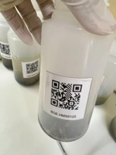

.. |logo_BGE_alpha| image:: _static/logo_BGE_alpha.png
  :width: 300
  :alt: Alternative text
  :target: https://biodiversitygenomics.eu/

.. |eufund| image:: _static/eu_co-funded.png
  :width: 200
  :alt: Alternative text

.. |chfund| image:: _static/ch-logo-200x50.png
  :width: 210
  :alt: Alternative text

.. |ukrifund| image:: _static/ukri-logo-200x59.png
  :width: 150
  :alt: Alternative text

.. |logo_BGE_small| image:: _static/logo_BGE_alpha.png
  :width: 120
  :alt: Alternative text
  :target: https://biodiversitygenomics.eu/

.. raw:: html

    

.. role:: red

|logo_BGE_alpha|

Malaise trap
************

Malaise samples processing within `Biodiversity Genomics Europe <https://biodiversitygenomics.eu/>`_ project
follow the `FAVIS protocol (hosted in protocols.io) <https://dx.doi.org/10.17504/protocols.io.kqdg36261g25/v2>`_.

|malaise_bottle|

____________________________________________________

|logo_BGE_small| |eufund| |chfund| |ukrifund|
