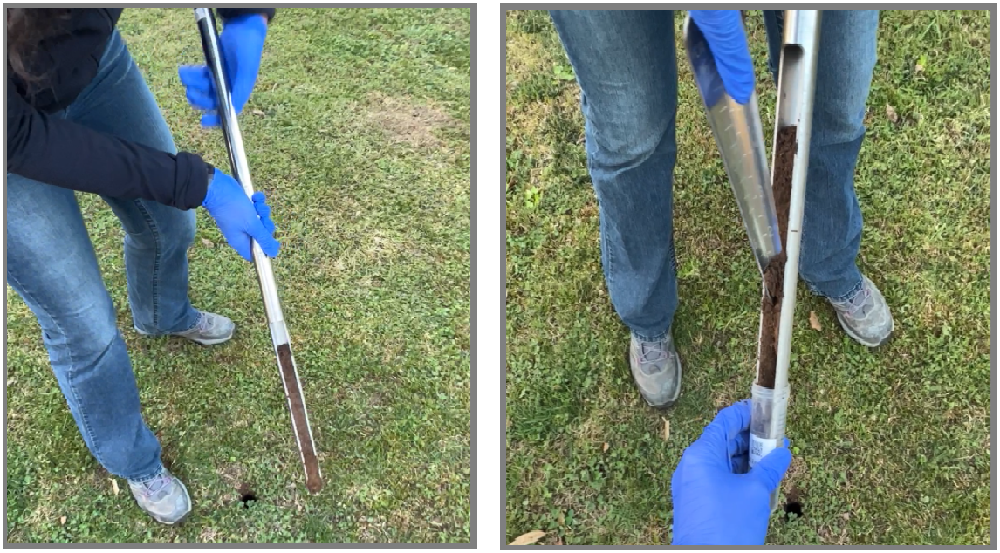
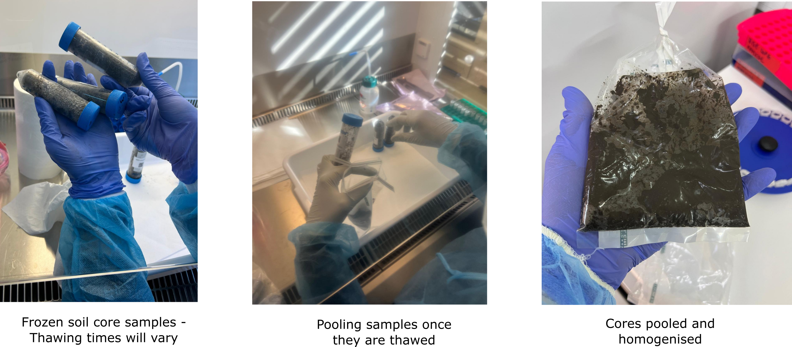

.. |logo_BGE_alpha| image:: _static/logo_BGE_alpha.png
  :width: 300
  :alt: Alternative text
  :target: https://biodiversitygenomics.eu/

.. |eufund| image:: _static/eu_co-funded.png
  :width: 200
  :alt: Alternative text

.. |chfund| image:: _static/ch-logo-200x50.png
  :width: 210
  :alt: Alternative text

.. |ukrifund| image:: _static/ukri-logo-200x59.png
  :width: 150
  :alt: Alternative text

.. |oven_dry| image:: _static/oven_dry.jpg
  :width: 350
  :alt: Alternative text
  :class: center

.. |logo_BGE_small| image:: _static/logo_BGE_alpha.png
  :width: 120
  :alt: Alternative text
  :target: https://biodiversitygenomics.eu/

.. raw:: html

    

.. role:: red

|logo_BGE_alpha|

Soil
****

General guidelines for preparing soil samples for metabarcoding studies :ref:`for DNA extraction <DNAex_soil>`.

Soil storage and homogenisation after collection
------------------------------------------------

Soil samples are collected as "soil cores" and generally these cores can be quickly pooled in the field in sterile plastic bags, or stored individually to be pooled later in the lab.
The samples are then transported to the lab in cool conditions (e.g. in a cooler box with ice packs or dry ice). 

|soil_coring|

.. note:: 

 The `Biodiversity Genomics Europe <https://biodiversitygenomics.eu/>`_ followed individual core storage within sterile Falcon tubes, placing each sample 
 immediately on dry ice to prevent microbial overgrowth and external contamination. The soil sampling SOP (`Najera-Cortazar et al. 2024 <https://workflowhub.eu/sops/19>`_) can be found in :ref:`sampling soil <soilsampling>` and in the :ref:`BGE case studies section <casestudies>`

**Thawing**

Pooling individual soil core samples:

1. Take out of the freezer the soil cores that will be processed
   
2. Once the soil cores from the same site and depth are thawed, transfer each soil core to a sterile zip-lock plastic bag 
   
3. Close the bag and homogenise the soil quckly, avoiding too much manipulation to not warm up the pooled sample

|thawing|

4. Weigh maximum of **250 mg** (~100 mg for very organic rich sample) of the soil mixture to a 2 mL
   PowerBead Pro Tube. Store the PowerBead Pro tubes with the soil at
   -20ºC until further steps. Or proceed immediately with the :ref:`DNA extraction <DNAex_soil>`.

.. note:: 

 Thawing time can take between 10-30 minutes depending on sample size, water content and type of soil. 
 Take out of the freezer small batches of core samples to avoid multiple freeze-thaw cycles.

**Oven drying**

1. After collection or after thawing and pooling (if soil samples were frozen in individual containers), transfer soil into a clean paper 
   bag and active thaw/dry the samples in an oven at ~37ºC.
   
|oven_dry|

2. When the soil is dry, then homogenise the soil sample by 
   for example transferring soil to a sterile zip-lock plastic bag that is **reinforced**
   with the tape on the sides and crush the soil in between the hands into fine 
   soil powder.

3. Weigh maximum of **250 mg** (~100 mg for very organic rich sample) of the soil powder to a 2 mL
   PowerBead Pro Tube. Store the PowerBead Pro tubes with the soil at
   -20ºC until further steps. Or proceed immediately with the :ref:`DNA extraction <DNAex_soil>`.

____________________________________________________

Herein processes follow lab SOP for the 'Characterization of Prokaryotic and 
Eukaryotic Biodiversity from Soil Samples' (Chaves et al., 2025a)
within `Biodiversity Genomics Europe <https://biodiversitygenomics.eu/>`_ project. 
This is mirror for the workflow hosted in `WorkflowHub <https://doi.org/10.48546/workflowhub.sop.12.2>`_
*(which hosts the downloadable PDF).*

____________________________________________________

**References**

   Chaves, C., Najera Cortazar, L. A., Martins, F., Anslan, S., Beja-Pereira, A., Magalhães, M., & Price, B. (2025a). Characterization of Prokaryotic and Eukaryotic Biodiversity from Soil Samples. WorkflowHub. https://doi.org/10.48546/workflowhub.sop.12.2
   
   Najera-Cortazar, L. A., Beja-Pereira, A., & Beja, P. (2024a). Biodiversity Genomics Europe | Ecological Restoration - Soil sampling. WorkflowHub. https://doi.org/10.48546/workflowhub.sop.19.1 

____________________________________________________

|logo_BGE_small| |eufund| |chfund| |ukrifund|
