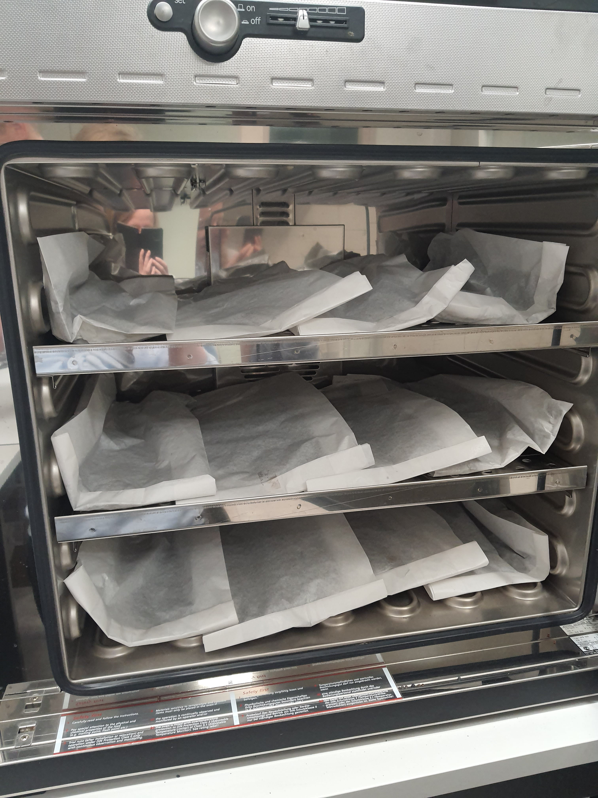

.. |logo_BGE_alpha| image:: _static/logo_BGE_alpha.png
  :width: 300
  :alt: Alternative text
  :target: https://biodiversitygenomics.eu/

.. |eufund| image:: _static/eu_co-funded.png
  :width: 200
  :alt: Alternative text

.. |chfund| image:: _static/ch-logo-200x50.png
  :width: 210
  :alt: Alternative text

.. |ukrifund| image:: _static/ukri-logo-200x59.png
  :width: 150
  :alt: Alternative text

.. |logo_BGE_small| image:: _static/logo_BGE_alpha.png
  :width: 120
  :alt: Alternative text
  :target: https://biodiversitygenomics.eu/

.. raw:: html

    

.. role:: red

|logo_BGE_alpha|

Soil
****

Herein processes follow lab SOP for the 'Characterization of Prokaryotic and Eukaryotic Biodiversity from Soil Samples' (Chaves et al., 2025a)
within `Biodiversity Genomics Europe <https://biodiversitygenomics.eu/>`_ project. 
This is mirror for the workflow hosted in `WorkflowHub <WorkflowHub. <https://doi.org/10.48546/workflowhub.sop.12.2>`_
*(which hosts the downloadable PDF).*

General guidelines for preparing soil samples for metabarcoding studies :ref:`for DNA extraction <DNAex_soil>`.

1. After collection (or if soil samples are frozen), transfer soil into a clean paper 
   bag and active thaw/dry the samples in an oven at ~37ºC.
   
|oven_dry|

2. When the soil is dry, then homogenise the soil sample by 
   for example transferring soil to a sterile zip-lock plastic bag that is **reinforced**
   with the tape on the sides and crush the soil in between the hands into fine 
   soil powder.

3. Weigh maximum of **250 mg** (~100 mg for very organic rich sample) of the soil powder to a 2 mL
   PowerBead Pro Tube. Store the PowerBead Pro tubes with the soil at
   -20ºC until further steps. Or proceed immediately with the DNA extraction.

____________________________________________________

**References**

   Chaves, C., Najera Cortazar, L. A., Martins, F., Anslan, S., Beja-Pereira, A., Magalhães, M., & Price, B. (2025a). Characterization of Prokaryotic and Eukaryotic Biodiversity from Soil Samples. WorkflowHub. https://doi.org/10.48546/workflowhub.sop.12.2

____________________________________________________

|logo_BGE_small| |eufund| |chfund| |ukrifund|
