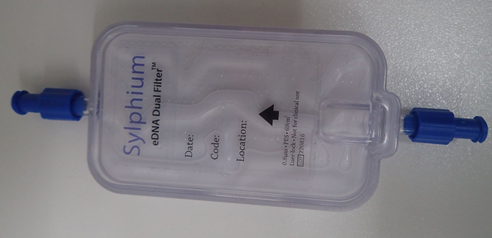

.. |logo_BGE_alpha| image:: _static/logo_BGE_alpha.png
  :width: 300
  :alt: Alternative text
  :target: https://biodiversitygenomics.eu/

.. |eufund| image:: _static/eu_co-funded.png
  :width: 200
  :alt: Alternative text

.. |chfund| image:: _static/ch-logo-200x50.png
  :width: 210
  :alt: Alternative text

.. |ukrifund| image:: _static/ukri-logo-200x59.png
  :width: 150
  :alt: Alternative text

.. |logo_BGE_small| image:: _static/logo_BGE_alpha.png
  :width: 120
  :alt: Alternative text
  :target: https://biodiversitygenomics.eu/

.. raw:: html

    

.. role:: red

|logo_BGE_alpha|

Water
*****

.. _prep_sylphium_dual_filters:

Herein processes follow lab SOP for the 'Detection of Non-Indigenous Marine Species from Port Water Samples' (Chaves et al., 2025)
within `Biodiversity Genomics Europe <https://biodiversitygenomics.eu/>`_ project. 
This is mirror for the workflow hosted in `WorkflowHub <https://doi.org/10.48546/workflowhub.sop.11.2>`_
*(which hosts the downloadable PDF).*

___________________________________________________

Sylphium dual filters
---------------------

The `Biodiversity Genomics Europe <https://biodiversitygenomics.eu/>`_ project uses Sylphium dual filters to ensure efficient and clean filtration of water samples for metabarcoding. 
These filters are designed to capture a wide range of DNA fragments while minimizing contamination risks. 

|sylphium_filter|

.. note:: 

  Water samples are generally low DNA yeild samples, thus especially **prone to contamination** compared with 
  other sample types. Thus, prepare the samples under laminar flow hood with UV lamps for UV sterilization.

___________________________________________________

Check filters 
~~~~~~~~~~~~~~

Clean the working space and material with disinfectant (e.g. 5-10% bleach) and ethanol (to vipe off bleach) and 
leave the UV light on for at least 15 mins.

Check if filters have leaked, have less than ~2 mL of ATL buffer inside. If yes, then: 

* Thaw  and clean  the  outside  of  the  capsules  using  a  disinfectant.
  Refill  them  with  2.5  mL  ATL buffer and seal each cap with parafilm.
* Incubate in the oven at 37 ºC for 30 min.

___________________________________________________

Prepare filters for DNA extraction
~~~~~~~~~~~~~~~~~~~~~~~~~~~~~~~~~~

* Set the oven at 56ºC
* Clean the working space and material with disinfectant and ethanol and leave the UV-light on for at least 15 minutes;
* Use filtered pipette tips at all steps;
* For each 23-sample batch, include a negative control (PNC) by preparing a 15-ml tube with 2 mL ATL + 50 μL Proteinase K (20mg/mL).

#. Thaw  the  capsules and clean the outside of each capsule using a disinfectant solution.  
#. Fill each capsule with 60 μL of Proteinase K (20mg/mL) and shake it manually. 
#. Seal each capsule cap with parafilm, and incubate at 56ºC overnight in the mechanical shaker. 

Proceed with :ref:`DNA extraction <DNAex_sylphium_dual_filters>`.

____________________________________________________

**References**

   Chaves, C., Najera-Cortazar, L. A., Martins, F., Veríssimo, J., Dunshea, G., & Price, B. (2025). 
   Detection of Non-Indigenous Marine Species from Port Water Samples. WorkflowHub. 
   https://doi.org/10.48546/workflowhub.sop.11.2

____________________________________________________

|logo_BGE_small| |eufund| |chfund| |ukrifund|
