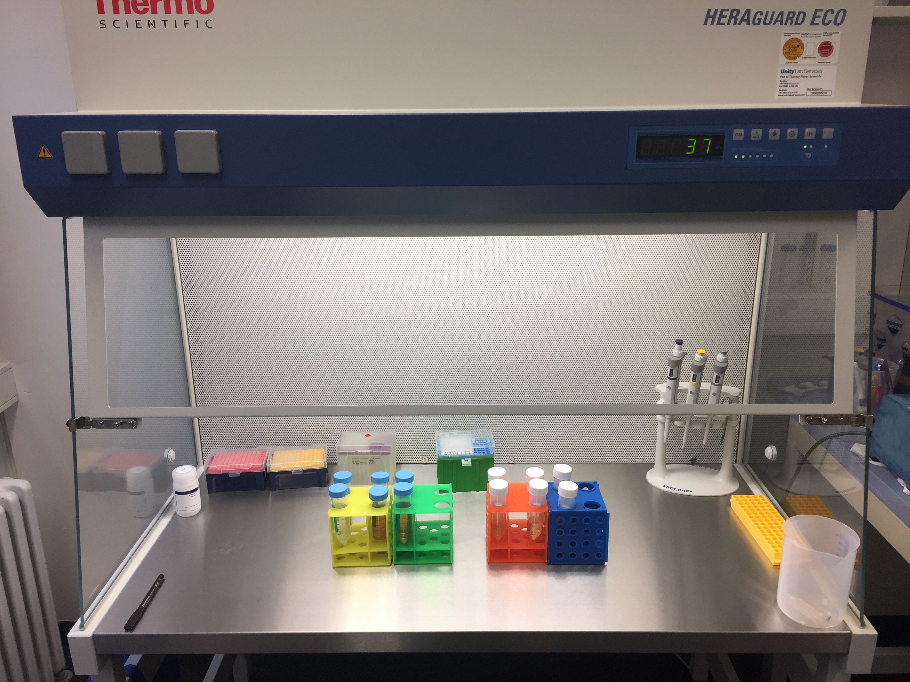

.. |logo_BGE_alpha| image:: _static/logo_BGE_alpha.png
  :width: 300
  :alt: Alternative text
  :target: https://biodiversitygenomics.eu/

.. |eufund| image:: _static/eu_co-funded.png
  :width: 200
  :alt: Alternative text

.. |chfund| image:: _static/ch-logo-200x50.png
  :width: 210
  :alt: Alternative text

.. |ukrifund| image:: _static/ukri-logo-200x59.png
  :width: 150
  :alt: Alternative text

.. |insect| image:: _static/google_fonts/insect.png
  :width: 50
  :alt: Alternative text

.. |logo_BGE_small| image:: _static/logo_BGE_alpha.png
  :width: 120
  :alt: Alternative text
  :target: https://biodiversitygenomics.eu/
  
.. raw:: html

    

.. role:: red

|logo_BGE_alpha|

DNA extraction
**************

DNA extraction protocols for water, soil and Malaise trap samples. 

.. grid:: 3

    .. grid-item-card::
        :text-align: center
        :link: 3DNA_extraction_water.html

        |water|

        **Water**

    .. grid-item-card::
        :text-align: center
        :link: 3DNA_extraction_soil.html

        |soil|
          
        **Soil**

    .. grid-item-card::
        :text-align: center
        :link: 3DNA_extraction_malaise.html

        |insect|
          
        **Malaise trap**

    
|DNA_ex|

.. toctree::
   :maxdepth: 1

   3DNA_extraction_water
   3DNA_extraction_soil
   3DNA_extraction_malaise

____________________________________________________

**References**

        Chaves, C., Najera Cortazar, L. A., Martins, F., Anslan, S., Beja-Pereira, A., Magalhães, M., & Price, B. (2025a). Characterization of Prokaryotic and Eukaryotic Biodiversity from Soil Samples. WorkflowHub. https://doi.org/10.48546/workflowhub.sop.12.2

        Chaves, C., Najera Cortazar, L. A., Martins, F., Veríssimo, J., Dunshea, G., & Price, B. (2025b). Detection of Non-Indigenous Marine Species from Port Water Samples. WorkflowHub. https://doi.org/10.48546/workflowhub.sop.11.2

        Najera-Cortazar, L. A., Perez-Delgado, A., & Emerson, B. (2026). Biodiversity Genomics Europe | Invertebrate characterization from bulk arthropod samples. WorkflowHub. https://doi.org/10.48546/workflowhub.sop.26.1

____________________________________________________

|logo_BGE_small| |eufund| |chfund| |ukrifund|
