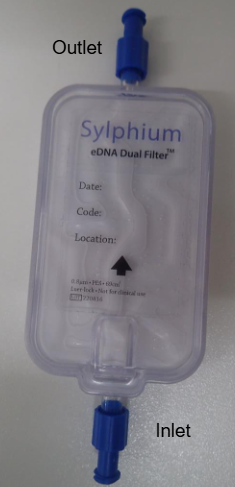

.. |logo_BGE_alpha| image:: _static/logo_BGE_alpha.png
  :width: 300
  :alt: Alternative text
  :target: https://biodiversitygenomics.eu/

.. |eufund| image:: _static/eu_co-funded.png
  :width: 200
  :alt: Alternative text

.. |chfund| image:: _static/ch-logo-200x50.png
  :width: 210
  :alt: Alternative text

.. |ukrifund| image:: _static/ukri-logo-200x59.png
  :width: 150
  :alt: Alternative text

.. |logo_BGE_small| image:: _static/logo_BGE_alpha.png
  :width: 120
  :alt: Alternative text
  :target: https://biodiversitygenomics.eu/

.. raw:: html

    

.. role:: red

|logo_BGE_alpha|

Water
*****

Herein processes follow lab SOP for the 'Detection of Non-Indigenous Marine Species from Port Water Samples' (Chaves et al., 2025b)
within `Biodiversity Genomics Europe <https://biodiversitygenomics.eu/>`_ project. 
This is mirror for the workflow hosted in `WorkflowHub <https://doi.org/10.48546/workflowhub.sop.11.2>`_
*(which hosts the downloadable PDF).*

.. _DNAex_sylphium_dual_filters:

Sylphium dual filters
~~~~~~~~~~~~~~~~~~~~~

|sylphium_filter2|

Samples for the following DNA extraction have 
been :ref:`prepared according to guidelines here <prep_sylphium_dual_filters>`.

___________________________________________________

Equipment and Consumables
~~~~~~~~~~~~~~~~~~~~~~~~~~

+------------------------------------------+-------------------+---------+
| Items                                    | quantity          | storage |
+==========================================+===================+=========+
| Sylphium capsules filled with ATL buffer | 3.5 mL per sample | -20°C   |
+------------------------------------------+-------------------+---------+
| 96% Ethanol (EtOH)                       | 6.6 mL per sample | 15-25ºC |
+------------------------------------------+-------------------+---------+
| 50ml Syringes                            | 1 per sample      |         |
+------------------------------------------+-------------------+---------+
| Proteinase K (PK)                        | 40 μL per sample  | -20°C   |
+------------------------------------------+-------------------+---------+
| Qiagen DNeasy Blood and Tissue kit       |                   | 15-25ºC |
+------------------------------------------+-------------------+---------+
| 96-well 0.2 mL PCR plate                 | 1 plate           |         |
+------------------------------------------+-------------------+---------+

___________________________________________________

Procedure 
~~~~~~~~~~

Assuming that the samples have been prepared according to :ref:`guidelines here <prep_sylphium_dual_filters>`:

* Set the thermoblock at 70ºC; 
* Set the oven at 55ºC; 
* Clean the working space and material with disinfectant (e.g. 5-10% bleach) and ethanol (to vipe off bleach) and leave the UV light on for at least 15 mins;
* Use filtered pipette tips at all steps; 
* If AL buffer has precipitate, heat to 55°C for 5-10 min to dissolve. 
* Follow the manufacturer's instructions (for Qiagen DNeasy Blood and Tissue kit) to prepare the AW1 and AW2 buffers. 
* AL buffer + ethanol (96%) could be used pre-mixed.

1. Mix each capsule by hand and transfer its content into a 15 mL tube using a syringe, through the inlet side. 
2. Add 96% ethanol and AL Buffer to each tube in a 1:1:1 ratio 
   (e.g. 2,000 μL ATL + PK : 2,000 μL AL buffer: 2,000 μL 96% ethanol). 
   Vortex tubes immediately, for 20s, and short-spin them.
3. Capture and purify the eDNA following either option a) or b):

  **a.** By centrifugation (based on the DNeasy Blood and Tissue standard protocol):

    i. Load up to **650 μL of supernatant** onto a Mini Spin Column. Centrifuge at **6,000 x g for 1 min**.  
    ii. Discard  the  2-mL  collection  tube  and  replace  it  with  a  new  collection  tube  (not provided). Repeat until all the supernatant has been processed. 
    iii. Place the Mini Spin Column Filter into a clean 2-mL collection tube (provided). 
    iv. Add **500  μL  of  AW1  Buffer** and  centrifuge  at **6,000  x  g  for  1  min**.  Discard  the  2-mL collection tube, and place the Mini Spin Column in a new collection tube (provided). 
    v. Add **500 μL of AW2 Buffer** and centrifuge at **20,000 x g for 1 min**. Discard the 2-mL collection tube. 

  **b.** Using the QIAvac 24 Plus vacuum manifold as an alternative: 

    i. Place the Mini Spin Columns in the QIAvac system
    ii. Load **650 μL of supernatant** onto a Mini Spin Column.
    iii. Turn on the vacuum pump at -80/-90 kPa. 
    iv. Repeat the previous steps until all the supernatant has been processed. 
    v. Add **500 μL of AW1 Buffer**. 
    vi. Add **500 μL of AW2 Buffer**. 
    vii. Turn off the vacuum pump once all the volume has passed through.

4. Place the DNeasy Mini Spin Column in a new collection tube. 
   Centrifuge at **20,000 x g for 2 min** to completely dry the membrane. 
   Discard the collection tube containing the flow-through. 
5. Place the column in a clean 1.5 mL tube and add **100 μL of heated TE** (at 70ºC) 
   to the centre of the column membrane.  
6. Incubate for **10 min** at room temperature. Centrifuge at **6,000 x g for 1 min**.  
7. Repeat previous two steps above (5-6) using the same 1.5 mL tube to obtain maximum yield. 
8. Transfer **60 μL** eDNA extract to a 96-well plate (working plate) and archive the remaining at -20ºC or -80ºC. Leave at least two empty wells per plate for the PCR negative control (PNC).   
9. Quantify the samples by spectrophotometry. Dilute samples with EB buffer into a new 96-well plate (if needed). 

____________________________________________________

**References**

   Chaves, C., Najera Cortazar, L. A., Martins, F., Veríssimo, J., Dunshea, G., & Price, B. (2025b). Detection of Non-Indigenous Marine Species from Port Water Samples. WorkflowHub. https://doi.org/10.48546/workflowhub.sop.11.2

____________________________________________________

|logo_BGE_small| |eufund| |chfund| |ukrifund|
