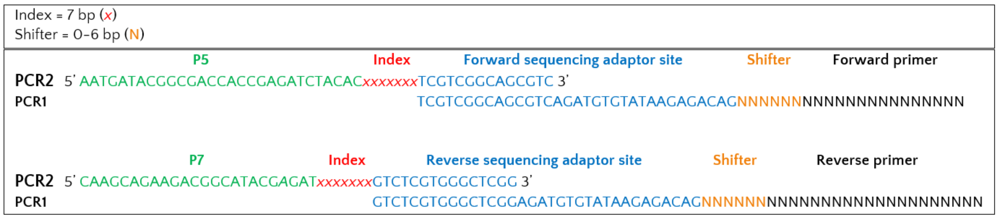

.. |logo_BGE_alpha| image:: _static/logo_BGE_alpha.png
  :width: 300
  :alt: Alternative text
  :target: https://biodiversitygenomics.eu/

.. |eufund| image:: _static/eu_co-funded.png
  :width: 200
  :alt: Alternative text

.. |chfund| image:: _static/ch-logo-200x50.png
  :width: 210
  :alt: Alternative text

.. |ukrifund| image:: _static/ukri-logo-200x59.png
  :width: 150
  :alt: Alternative text

.. |logo_BGE_small| image:: _static/logo_BGE_alpha.png
  :width: 120
  :alt: Alternative text
  :target: https://biodiversitygenomics.eu/

.. raw:: html

    

.. role:: red

.. _ampliconCOI:

|logo_BGE_alpha|

COI
***

Amplicon library preparation for mitochondrial 
cytochrome c oxidase subunit I (COI) region to target **arthropod communities** in soil samples using **2-step PCR** 
with primers **mICOIintF-XT** (GGWACWRGWTGRACWITITAYCCYCC) [`Wangensteen et al 2018 <https://doi.org/10.7717/peerj.4705>`_] and **jgHCO2198** (TAIACYTCIGGRTGICCRAARAAYCA) 
[`Geller et al 2013 <https://doi.org/10.1111/1755-0998.12138>`_]. For water 
samples, COI was amplified with primers **FwhF2** (GGDACWGGWTGAACWGTWTAYCCHCC) and **FwhR2n** (GTRATWGCHCCDGCTARWACWGG) [`Vamos et al 2017 <https://doi.org/10.1111/2041-210X.12789>`_].

Herein processes follow lab SOP for the 'Characterization of Prokaryotic and 
Eukaryotic Biodiversity from Soil Samples' (Chaves et al., 2025); 
the workflow is hosted in `WorkflowHub <https://doi.org/10.48546/workflowhub.sop.12.2>`_
*(hosts the downloadable PDF).*

*Besides used primers and the PCR conditions for the 1st PCR, the protocol in identical to* 
:ref:`ITS2 <ampliconITS2>` *and* :ref:`16S <amplicon16S>` *library prep.*

.. admonition:: Primer constructs for 1st PCR

    +-----------------------------------+----------+----------------------------+
    | Forward sequencing adaptor site   | Shifter* | Forward primer             |
    +===================================+==========+============================+
    | TCGTCGGCAGCGTCAGATGTGTATAAGAGACAG | NNNNNN   | GGWACWRGWTGRACWITITAYCCYCC |
    +-----------------------------------+----------+----------------------------+

    +------------------------------------+----------------+----------------------------+
    | Reverse sequencing adaptor site    | Shifter*       |       Reverse primer       |
    +====================================+================+============================+
    | GTCTCGTGGGCTCGGAGATGTGTATAAGAGACAG | NNNNN          | TAIACYTCIGGRTGICCRAARAAYCA |
    +------------------------------------+----------------+----------------------------+

    \* Shifter is 0-6 bp

.. admonition:: Indexing primer constructs for 2nd PCR (indexing PCR) with overhangs to sequencing adaptor sites:

    +-------------------------------+---------+------------------+
    | P5 (forward) adapter          | Index   | Forward overhang |
    +===============================+=========+==================+
    | AATGATACGGCGACCACCGAGATCTACAC | NNNNNNN | TCGTCGGCAGCGTC   |  
    +-------------------------------+---------+------------------+

    +--------------------------+---------+------------------+
    | P7 (reverse) adapter     | Index   | Reverse overhang |
    +==========================+=========+==================+
    | CAAGCAGAAGACGGCATACGAGAT | NNNNNNN | GTCTCGTGGGCTCGG  |
    +--------------------------+---------+------------------+

Full construct:
|primer_constructs|

___________________________________________________

1st PCR - **mICOIintF-XT** + **jgHCO2198**
-------

**Consumables:**

+------------------------+-----------------+-------------+-----------+
| Items                  | Initial         | Quantity    | Storage   |
|                        | Concentration   |             |           |
+========================+=================+=============+===========+
| eDNA *(dilution        | 10 ng/µL        | 1 µL per    | -15° to   |
| plate)*                |                 | sample      | -25°C     |
+------------------------+-----------------+-------------+-----------+
| Amplicon PCR Forward   | 10 µM           | 0.25 µL per | -15° to   |
| Primer                 |                 | sample      | -25°C     |
+------------------------+-----------------+-------------+-----------+
| Amplicon PCR Reverse   | 10 µM           | 0.25 µL per | -15° to   |
| Primer                 |                 | sample      | -25°C     |
+------------------------+-----------------+-------------+-----------+
| Qiagen Master Mix      | 5x              | 5 µL per    | -15° to   |
|                        |                 | sample      | -25°C     |
+------------------------+-----------------+-------------+-----------+
| Ultrapure water        |                 | 3.5 µL per  |           |
|                        |                 | sample      |           |
+------------------------+-----------------+-------------+-----------+
| 96-well 0.2 mL PCR     |                 | 1 plate     |           |
| plate                  |                 |             |           |
+------------------------+-----------------+-------------+-----------+

Total volume per PCR reaction = **10µL**. 

**PCR conditions:**

+----------------------+------------+
| 95ºC for 15 minutes  |            |
+----------------------+------------+
|| 95ºC for 30 seconds ||           |
|| 50ºC for 60 seconds || 38 cycles |
|| 72ºC for 30 seconds ||           |
+----------------------+------------+
| 72ºC for 10 minutes  |            |
+----------------------+------------+
| Hold at 10ºC         |            |
+----------------------+------------+

**Expected amplicon size = 499 bp** *(insert length (313 bp) + primer lengths + 6 bp NNs (avg.) + 67 bp overhangs).*

● Test the PCR success of all samples through electrophoresis of 2 µL using 2% agarose gel.

●	Dilute samples 1:4 using ultrapure water.

___________________________________________________

1st PCR -  **FwhF2** + **FwhR2n** 
-------

**Consumables:**

+------------------------+-----------------+-------------+-----------+
| Items                  | Initial         | Quantity    | Storage   |
|                        | Concentration   |             |           |
+========================+=================+=============+===========+
| eDNA *(dilution        | 10 ng/µL        | 2 µL per    | -15° to   |
| plate)*                |                 | sample      | -25°C     |
+------------------------+-----------------+-------------+-----------+
| Amplicon PCR Forward   | 10 µM           | 0.25 µL per | -15° to   |
| Primer                 |                 | sample      | -25°C     |
+------------------------+-----------------+-------------+-----------+
| Amplicon PCR Reverse   | 10 µM           | 0.25 µL per | -15° to   |
| Primer                 |                 | sample      | -25°C     |
+------------------------+-----------------+-------------+-----------+
| Qiagen Master Mix      | 5x              | 5 µL per    | -15° to   |
|                        |                 | sample      | -25°C     |
+------------------------+-----------------+-------------+-----------+
| Ultrapure water        |                 | 32.5 µL per  |           |
|                        |                 | sample      |           |
+------------------------+-----------------+-------------+-----------+
| 96-well 0.2 mL PCR     |                 | 1 plate     |           |
| plate                  |                 |             |           |
+------------------------+-----------------+-------------+-----------+

Total volume per PCR reaction = **10µL**. 

**PCR conditions:**

+----------------------+------------+
| 95ºC for 15 minutes  |            |
+----------------------+------------+
|| 95ºC for 30 seconds ||           |
|| 50ºC for 60 seconds || 35 cycles |
|| 72ºC for 30 seconds ||           |
+----------------------+------------+
| 72ºC for 10 minutes  |            |
+----------------------+------------+
| Hold at 10ºC         |            |
+----------------------+------------+

**Expected amplicon size = 323 bp** *(insert length (205 bp) + primer lengths + 6 bp NNs (avg.) + 67 bp overhangs).*

● Test the PCR success of all samples through electrophoresis of 2 µL using 2% agarose gel.

●	Dilute samples 1:4 using ultrapure water.

___________________________________________________

2nd PCR (indexing PCR)
----------------------

**Consumables:**

+-------------------------------+----------------+-------------------+---------------+
|| Items                        || Initial       || Quantity         || Storage      |
||                              || Concentration ||                  ||              |
+-------------------------------+----------------+-------------------+---------------+
| PCR 1 (*diluted* 1:4)         | *n.i.*         | 2.8 µL per sample | -15° to -25°C |
+-------------------------------+----------------+-------------------+---------------+
| P5-P7 Index Primer Mix        | 10 µM          | 1.4 µL per sample | -15° to -25°C |
+-------------------------------+----------------+-------------------+---------------+
| KAPA HiFi Hot-Start Ready Mix | 2x             | 7 µL per sample   | -15° to -25°C |
+-------------------------------+----------------+-------------------+---------------+
| H2O                           |                | 2.8 µL per sample |               |
+-------------------------------+----------------+-------------------+---------------+
| 96-well 0.2 mL PCR plate      |                | 1 plate           |               |
+-------------------------------+----------------+-------------------+---------------+

**Procedure:**

1. Transfer **1.4 µL** of each mixed combination of P5 and P7 indexing primers to a new plate.

2. Set up the following reaction per sample:

+-------------------------------+------------+
|                               | 1X         |
+===============================+============+
| KAPA HiFi Hot-Start Ready Mix | 7 µL       |
+-------------------------------+------------+
| H2O                           | 2.8 µL     |
+-------------------------------+------------+
| Total                         | **9.8 µL** |
+-------------------------------+------------+

3. Mix the reagents by pipetting, spin down and distribute it in each well.

4. Add **2.8 µL** of the diluted PCR1 product.

5. Seal plate and perform PCR in a thermal cycler using the following conditions:

+----------------------+-----------+
| 95ºC for 3 minutes   |           |
+----------------------+-----------+
|| 95ºC for 30 seconds ||          |
|| 55ºC for 30 seconds || 8 cycles |
|| 72ºC for 30 seconds ||          |
+----------------------+-----------+
| 72ºC for 5 minutes   |           |
+----------------------+-----------+
| Hold at 10ºC         |           |
+----------------------+-----------+

6. Test size shift between PCR1 and PCR2 amplicons of 15% of samples (e.g. 4 sets of 4 samples selected from random rows) through electrophoresis in 2% agarose gel.

___________________________________________________

Clean PCR products
------------------

This step uses magnetic beads to purify PCR products from free primers and primer-dimers.

**Equipment and consumables:**

+----------------------------------------+---------------+------------+
| Items                                  | Quantity      | Storage    |
+========================================+===============+============+
| Qiagen EB Buffer                       | 25 µL per     | 15ºC -     |
|                                        | sample        | 25ºC       |
+----------------------------------------+---------------+------------+
| KAPA HyperPure Beads                   | 8 µL per      | 4ºC        |
|                                        | sample        |            |
+----------------------------------------+---------------+------------+
| Freshly prepared 80% ethanol (EtOH)    | 300 µL per    |            |
|                                        | sample        |            |
+----------------------------------------+---------------+------------+
| Cell culture plate *(new)*             | 4 plates      |            |
+----------------------------------------+---------------+------------+
| 96-well PCR plate Non-skirted (VWR)    | 1 plate       |            |
+----------------------------------------+---------------+------------+
| Reservoirs                             | 1             |            |
+----------------------------------------+---------------+------------+
| Magnetic Bead Extractor for 96 Well    | 1             |            |
| Microplates (V&P Scientific)           |               |            |
+----------------------------------------+---------------+------------+
| Low-bind microplate (Optional)         | 1             |            |
+----------------------------------------+---------------+------------+

**Preparation:**

- Bring the **KAPA HyperPure beads** to room temperature for **30min** prior
  to usage;

- Prepare **fresh 80% ethanol**;

- Prepare a 50mL tube with EB Buffer and protect from any direct light
  source;

- Short spin the Amplicon PCR plate to collect condensation;

- Clean the working space and material with disinfectant and ethanol;

- Sterilize, under UV light for about **15min**, four U-bottom 96-well
  plates, a falcon with freshly prepared 80% ethanol and EB Buffer.

**Procedure:**

1. Distribute the appropriate volume of beads in one of the U-bottom
   96-well plates (*U-plate 1*).

   *Note: The volume of beads may depend on the ratio chosen, 
   which varies according to library size. 
   A standard ratio of 0,8x is used, adding 8 µL of beads for 10 µL of sample.*

2. Transfer the full PCR volume (10 µL) into the plate containing the
   KAPA HyperPure Beads, carefully pipetting the entire volume **up and
   down 10 times**.

3. Incubate at room temperature without shaking for **3 min**.

4. While in waiting, prepare three more U-bottom 96-well plates as
   following: two plates with **150µL 80% ethanol** and one plate with
   **25µL EB Buffer**.

5. Gently place a 96-well PCR plate on the plate from step 2 and attach
   the magnetic bead separation extractor for **2min** or until the
   supernatant is cleared.

6. Carefully remove the extractor and submerge the beads into one of the
   plates with freshly prepared 80% ethanol (*U-plate 2*) for **30s**.

7. Carefully remove the extractor and perform a second ethanol wash
   (*U-plate 3*).

8. Allow the beads to air-dry for **6-7min**.

..

   Note: Do not over-dry the beads, if they start to appear cracked
   immediately proceed to the next step.

9.  Carefully immerse the beads into the EB buffer (*U-plate 4*) and
    release the PCR plate from the extractor.

10. Carefully resuspend the beads in EB buffer.

11. Attach the magnetic extractor to the PCR plate for **2min** or until
    the supernatant is cleared.

12. Carefully remove the magnetic extractor and seal the U-bottom plate
    (or transfer it to a new low-bind PCR plate).

___________________________________________________

Pooling & quantification
------------------------

**Consumables:**

+-----------------------------------------------------------------------+
| Items                                                                 |
+=======================================================================+
| Qiagen EB Buffer                                                      |
+-----------------------------------------------------------------------+
| KAPA HyperPure Beads                                                  |
+-----------------------------------------------------------------------+
| 96-well 0.2 mL PCR plate                                              |
+-----------------------------------------------------------------------+
| KAPA Library Quantification Kit (Roche)                               |
+-----------------------------------------------------------------------+
| Tapestation High Sensitivity D5000 (Agilent)                          |
+-----------------------------------------------------------------------+
| Qubit HS (Themo Fisher Scientific)                                    |
+-----------------------------------------------------------------------+

**Procedure:**

1. Quantify each library using spectrophotometry (e.g Nanodrop) to estimate average library concentration (ng/µL).

2. Pool libraries equimolarly at 50 ng by taking the corresponding uL
   from each library. The negative controls should be added at a maximum
   volume than any other single library (up to 20 µL).

   *Note: In cases where the sample does not have volume to take 50ng, use the smallest common concentration available*

3. Clean the pool with KAPA HyperPure Beads.

   *Note: The volume of beads may depend on the ratio chosen, 
   which varies according to library size. A ratio of 0,7x can be used, adding 70 µL of beads for 100 µL of sample.*

4. Quantify library pool using *KAPA Library Quantification Kit* for qPCR, Qubit or Tapestation.

5. Dilute each library pool using Buffer EB according to specifications by sequencing provider (if needed).

6. Verify the final concentration of a library pool using *KAPA Library Quantification Kit* in qPCR.

___________________________________________________

**References**

   Chaves, C., Najera Cortazar, L. A., Martins, F., Anslan, S., Beja-Pereira, A., Magalhães, M., & Price, B. (2025). Characterization of Prokaryotic and Eukaryotic Biodiversity from Soil Samples. WorkflowHub. https://doi.org/10.48546/workflowhub.sop.12.2

___________________________________________________

|logo_BGE_small| |eufund| |chfund| |ukrifund|
