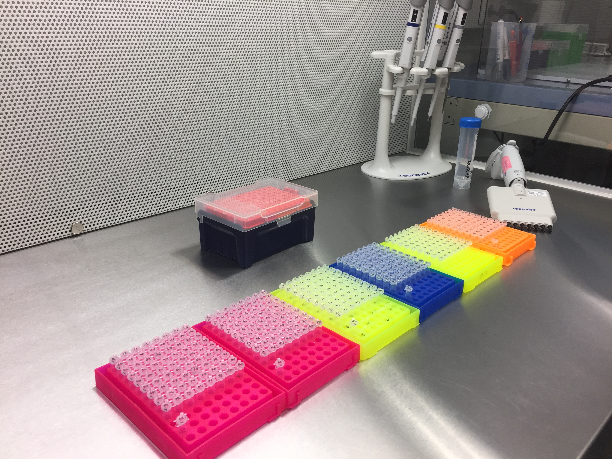
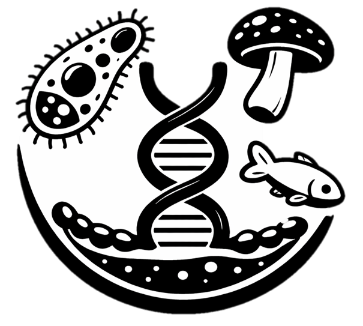

.. |logo_BGE_alpha| image:: _static/logo_BGE_alpha.png
  :width: 300
  :target: https://biodiversitygenomics.eu/

.. |eufund| image:: _static/eu_co-funded.png
  :width: 200

.. |chfund| image:: _static/ch-logo-200x50.png
  :width: 210

.. |ukrifund| image:: _static/ukri-logo-200x59.png
  :width: 150

.. |fish| image:: _static/fish.svg
  :width: 50

.. |logo_BGE_small| image:: _static/logo_BGE_alpha.png
  :width: 120
  :target: https://biodiversitygenomics.eu/

.. raw:: html

    

.. role:: red

|logo_BGE_alpha|

.. _amplicon_library_preparation:

Amplicon library preparation
****************************

Guidelines for amplicon library preparation for high-throughput sequencing on the **Illumina** platform.
The documentation provides **marker-specific** protocols for **16S** (bacteria), 
**ITS2** (fungi), and **COI** (arthropods).
Each protocol uses a **2-step PCR** design: 
a first PCR amplifies the target region with primers carrying 
Illumina sequencing adaptor sites and shifters; a second PCR adds P5/P7 indexing for multiplexing.
Consumables, thermocycling conditions, and cleanup steps are described in detail for each marker; 
the overall workflow is shared across markers, 
with differences mainly in primer pairs and 1st PCR annealing temperatures.

.. grid:: 3

    .. grid-item-card::
        :text-align: center
        :link: 4amplicon_16S.html

        |bacteria|

        **16S**

    .. grid-item-card::
        :text-align: center
        :link: 4amplicon_ITS.html

        |fungi|
          
        **ITS2**

    .. grid-item-card::
        :text-align: center
        :link: 4amplicon_COI.html

        |insect|
          
        **COI**

.. grid:: 2

    .. grid-item-card::
        :text-align: center
        :link: 4amplicon_18S.html

        |eukaryotes|

        **18S**

    .. grid-item-card::
        :text-align: center
        :link: 4amplicon_12S.html

        |fish|
          
        **12S**

|lab|

___________________________________________________

.. toctree::
   :maxdepth: 1

   4amplicon_16S
   4amplicon_ITS
   4amplicon_18S
   4amplicon_12S
   4amplicon_COI
   

|logo_BGE_small| |eufund| |chfund| |ukrifund|
