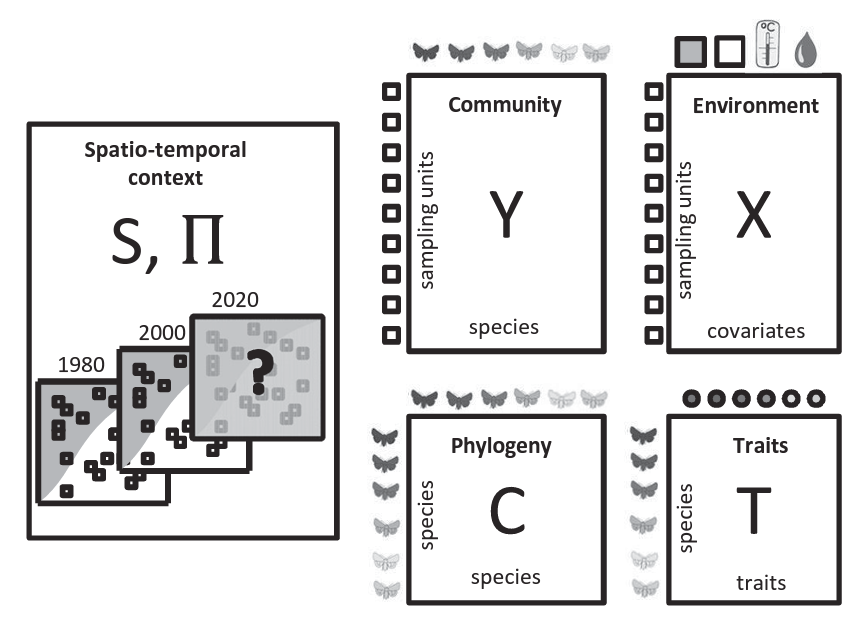

.. |eufund| image:: _static/eu_co-funded.png
  :width: 220
  :alt: Alternative text

.. |chfund| image:: _static/ch-logo-200x50.png
  :width: 210
  :alt: Alternative text

.. |ukrifund| image:: _static/ukri-logo-200x59.png
  :width: 150
  :alt: Alternative text

.. raw:: html

    

.. role:: red

Hierarchical Modelling of Species Communities
*********************************************

Hierarchical Modelling of Species Communities (HMSC) is a framework for Joint Species Distribution Modelling; 
a model-based approach for analyzing community 
ecological data (`Ovaskainen et al.2017 <https://doi.org/10.1111/ele.12757>`_).

The **obligatory data** for HMSC-analyses includes a matrix of **species occurrences or abundances** and a 
matrix of **environmental covariates** (sampling units as **rows**). Optionally additional input data include species 
traits and phylogeny, and information about the spatiotemporal context of the 
sampling design. HMSC yields inference both at species and community levels. 

|hmsc1|

Install HMSC
~~~~~~~~~~~~

.. code-block:: R
   :caption: install hmsc R package  
   :linenos:

   #!/usr/bin/Rscript

   # install 'devtools'; if not yet installed
   install.packages("devtools") 
   library(devtools)
   
   # install hmsc package
   install_github("hmsc-r/HMSC")

   # load hmsc
   library(Hmsc)

   # check the version
   packageVersion("Hmsc")

Example analyses X
~~~~~~~~~~~~~~~~~~

Description about the data, and place where to download the test data. 

Define models
-------------

Load data and define model ...

.. code-block:: R
   :caption: load data and define model
   :linenos:

   #!/usr/bin/Rscript

   # load community matrix (ASV/OTU table)

   # load environmental covariates

   

Fit models
----------

Fit models

etc
---

other ... 

____________________________________________________

|eufund| |chfund| |ukrifund|
