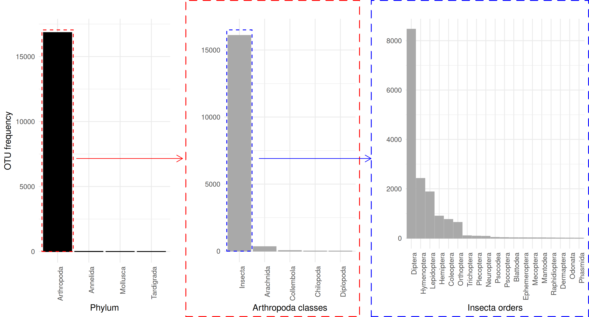
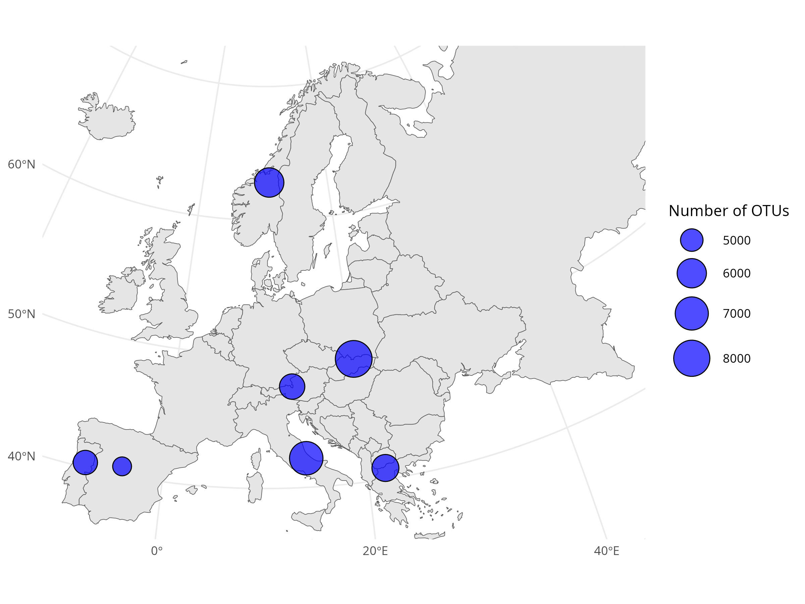
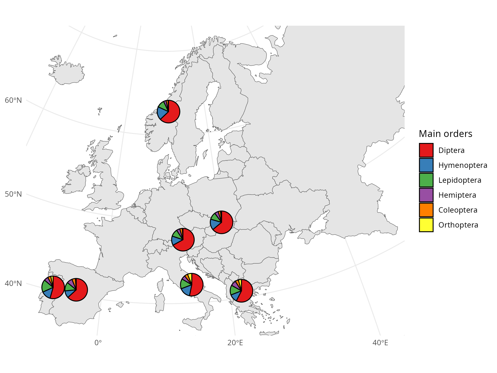

.. |eufund| image:: _static/eu_co-funded.png
  :width: 200
  :alt: Alternative text

.. |chfund| image:: _static/ch-logo-200x50.png
  :width: 210
  :alt: Alternative text

.. |ukrifund| image:: _static/ukri-logo-200x59.png
  :width: 150
  :alt: Alternative text

.. |logo_BGE_small| image:: _static/logo_BGE_alpha.png
  :width: 120
  :alt: Alternative text
  :target: https://biodiversitygenomics.eu/
  

  

  

.. raw:: html

    

.. role:: red

Examine outputs
***************

The outputs of a metabarcoding workflow and their basic reading are described 
in the :ref:`outputs section <outputs>` of :doc:`"What is a metabarcoding workflow?" <0what_is_metabarcoding>`.

In this section, we will examine the outputs of a metabarcoding workflow in relation to user collected environmental **metadata**
to inspect basic patterns of species (metabarcoding features) richness and composition across different environments.

___________________________________________________

Input data
==========

1. OTU table

2. OTU taxonomy table
   
3. Sample metadata

.. code-block:: R
    :caption: Loading the data
    :linenos:

    #!/usr/bin/Rscript

    ##-----------------------Settings-----------------------##
    ## Working directory and results directory paths
    wd = "E:/BGE/EBV_genetic composition"
    results = file.path(wd, "results")

    ## OTU taxonomy
    OTU.tax = file.path(wd, "data/otu_taxonomy_23062025.csv")
    
    ## OTU table
    OTU.table = file.path(wd, "data/otu_table_23062025.csv")
    
    ## Sample metadata
    sampleMetadata = file.path(wd, "data/Sample_metadata.csv")
    ##------------------------------------------------------##
    
    library(data.table)
    library(stringr)
    
    ## Loading data:
    ##--------------
    
    ## OTU taxonomic information
    OTU_tax = fread(file = OTU.tax, header = TRUE, sep = ";")
    
    ## OTU table
    OTU_table = fread(file = OTU.table, header = TRUE, sep = ";")
    
    ## Sample metadata
    sample_metadata = fread(file = sampleMetadata, header = TRUE, sep = "\t")
    
    

Richness
========

In this section we assess the total number of OTUs and the number of OTUs retrieved per country. 

.. code-block:: R
    :caption: OTU richness
    :linenos:

    #!/usr/bin/Rscript
    
    library(ggplot2)
    library(grid)
    library(gridExtra)
    
    ## Removing blank samples from OTU_table
    blank_cols <- names(OTU_table)[which(str_detect(names(OTU_table), "lank"))]
    OTU_table[, (blank_cols) := NULL]
    
    
    ## Number of OTUs (OTU richness):
    ##-------------------------------
    
    OTU_table[, uniqueN(OTU)]
    
    
    ## OTU richness per country:
    ##--------------------------
    
    ## Convert OTU table to long format
    OTU = melt(data = OTU_table,
           id.vars = "OTU", 
           variable.name = "sample", value.name = "Abundance") #renames column headers into a new column named "sample", and stores the values from the wide-format table into a new column called "Abundance"
    OTU = OTU[Abundance > 0]
    
    ## Adding "country" to OTU dataset
    OTU_country <- merge(x=OTU, y=sample_metadata[, .(country, sample)], by="sample", all.x = TRUE)
    
    ## Simplify the table to get the number of OTUs per country
    OTU_country_simple <- OTU_country[, .(N_OTU = uniqueN(OTU)), by=country]
    
    ## Mapping OTU richness in a map
    library(rnaturalearth)
    library(sf)
    
    mean.coords <- sample_metadata[, .(longitude = mean(unique(longitude)), latitude = mean(unique(latitude))), by=country]
    data2map <- merge(x = OTU_country_simple, y = mean.coords, by = "country")
    data2map <- as.data.frame(data2map)
    
    ## Getting Europe map
    world <- ne_countries(scale = "medium", returnclass = "sf")
    europe <- world[which(world$continent == "Europe"),]
    
    ## Transform to a projected CRS (ETRS89 / LAEA Europe)
    europe_proj <- st_transform(europe, crs = 3035)
    
    ## Also transform your point coordinates
    data2map_sf <- st_as_sf(data2map, coords = c("longitude", "latitude"), crs = 4326)
    data2map_proj <- st_transform(data2map_sf, crs = 3035)
    
    ## Transform your limits from lat/lon to projected coordinates
    bbox <- st_bbox(st_transform(
    	st_as_sfc(st_bbox(c(xmin = -10, xmax = 45, ymin = 34, ymax = 70), crs = 4326)),	
    	crs = 3035))
    	
    ## Plot
    map <- ggplot(europe_proj) +
    	geom_sf() +
    	geom_sf(data = data2map_proj, aes(size = N_OTU), pch = 21, fill = alpha("blue", 0.7), col="black") +
    	coord_sf(xlim = c(bbox["xmin"], bbox["xmax"]),
    		ylim = c(bbox["ymin"], bbox["ymax"]),
    		expand = FALSE) +
    	labs(size = "Number of OTUs") +
    	scale_size(range = c(6, 12)) +
    	theme_minimal() +
    	theme(plot.background = element_rect(fill = "white", color = "white"))
    	
    print(map)
    ggsave(file.path(results,"OTUrichnessCountry_map.png"),
       plot = map, width = 8, height = 6, dpi = 300)
    
    
|Map_OTUrichness|
 

Composition
===========

To assess the taxonomic composition of the OTU retrivered by metabarcoding, we use the OTU taxonomy table as the main input. 

.. code-block:: R
    :caption: OTU taxonomic composition
    :linenos:

    #!/usr/bin/Rscript
    
    ## Checking that all OTUs included in OTU_tax are all found in samples
    OTU_tax <- OTU_tax[OTU %in% OTU_table[, OTU]]
    
    
    ## Overall OTU taxonomic composition:
    ##-----------------------------------
    
    ## Number of phyla, orders, classes, etc. recovered
    taxcols <- names(OTU_tax)[which(names(OTU_tax)=="domain"):which(names(OTU_tax)=="species")]
    OTU_tax[, lapply(.SD, function(x) length(unique(x))), .SDcols = taxcols]
    
    ## Plotting the frequency of each phylum
    phylumData = OTU_tax[, .(phylum.freq = .N), by = phylum]
    phylumData$phylum <- factor(phylumData$phylum, levels = phylumData$phylum[order(phylumData$phylum.freq, decreasing = TRUE)])
    ## Plot (not showing those classified as "pseudophylum")
    phylum_hist <- ggplot(phylumData[!str_detect(phylum, "pseudo")], aes(x = phylum, y = phylum.freq)) +
    	geom_bar(stat = "identity", fill = "black", color = "black") +
    	theme_minimal() +
    	theme (axis.text.x = element_text(angle = 90, hjust = 1)) +
    	labs(title = "", x = "Phylum", y = "OTU frequency") +
    	annotate("rect", xmin = 0.5, xmax = 1.5, ymin = 0, ymax = 17050, color = "red", fill = NA, linetype = "dashed")
    ## Arthropoda classes
    classData = OTU_tax[phylum == "Arthropoda", .(class.freq = .N), by = class]
    classData$class <- factor(classData$class, levels = classData$class[order(classData$class.freq, decreasing = TRUE)])
    ## Plot (not showing those classified as "pseudoclass")
    class_hist <- ggplot(classData[!str_detect(class, "pseudo")], aes(x = class, y = class.freq)) +
    	geom_bar(stat = "identity", fill = "darkgrey", color = "darkgrey") +
    	theme_minimal() +
    	theme (axis.text.x = element_text(angle = 90, hjust = 1),
     	    plot.background = element_rect(fill = "white", color = "red", linetype = "dashed", linewidth = 1)) +
       	labs(title = "", x = "Arthropoda classes", y = "") +
        annotate("rect", xmin = 0.5, xmax = 1.5, ymin = 0, ymax = 16500, color = "blue", fill = NA, linetype = "dashed")
        ## Insecta orders
        orderData = OTU_tax[class == "Insecta", .(order.freq = .N), by = order]
        orderData$order <- factor(orderData$order, levels = orderData$order[order(orderData$order.freq, decreasing = TRUE)])
        ## Plot (not showing those classified as "pseudorder")
        order_hist <- ggplot(orderData[!str_detect(order, "pseudo")], aes(x = order, y = order.freq)) +
        	geom_bar(stat = "identity", fill = "darkgrey", color = "darkgrey") +
        	theme_minimal() +
        	theme (axis.text.x = element_text(angle = 90, hjust = 1),
        		plot.background = element_rect(fill = "white", color = "blue", linetype = "dashed", linewidth = 1)) +
        	labs(title = "", x = "Insecta orders", y = "")
    
    ## Combining and saving the plots:
    ## 1. Creating a grob from the arranged plots
    grob <- arrangeGrob(phylum_hist, 
                    rectGrob(gp = gpar(col = NA, fill = NA), height = unit(0.3, "cm")), #spacer
                    class_hist, 
                    rectGrob(gp = gpar(col = NA, fill = NA), height = unit(0.3, "cm")), #spacer
                    order_hist, 
                    nrow = 1, 
                    widths = c(0.8, 0.05, 0.8, 0.05, 1))
    ## 2. Saving the plot in png drawing connector lines
    png(file.path(results,"PhylumClassOrderFreqs.png"), width = 26, height = 14, units = "cm", res = 300)
    grid.draw(grob)
    grid.segments(x0 = 0.13, y0 = 0.5,  # Right side of first plot
                x1 = 0.31, y1 = 0.5,  # Left side of second plot
                gp = gpar(col = "red", lwd = 1),
                arrow = arrow(length = unit(0.3, "cm"), type = "open"))
    grid.segments(x0 = 0.44, y0 = 0.5,  # Right side of first plot
                x1 = 0.63, y1 = 0.5,  # Left side of second plot
                gp = gpar(col = "blue", lwd = 1),
                arrow = arrow(length = unit(0.3, "cm"), type = "open"))
    dev.off()
    
|Histograms|

How does the OTU taxonomic composition vary accross countries? In this case, we plotted the proportion of OTU per country that belong to each of the six main Insect orders detected in the samples.

.. code-block:: R
    :caption: OTU taxonomic composition per country - Insect main orders
    :linenos:

    #!/usr/bin/Rscript  
    
    ## Mapping OTU richness of Insect main orders per country:
    ##--------------------------------------------------------
    
    library(scatterpie)

    ## 1. Adding "order" to OTU_country
    OTU_country_order <- merge(x=OTU_country, y=OTU_tax[, .(OTU, order)], by="OTU", all.x = TRUE)
    counts_OTU_country_order <- OTU_country_order[, .(N_OTU = uniqueN(OTU)), by = c("country", "order")]
    
    ## 2. Selecting the main orders
    orderOTU <- OTU_tax[, .N, by = order][order(N, decreasing = T)]
    main_orders <- orderOTU[N>600, order]
    
    ## 3. Leaving only the main orders in the table
    data2plot <- counts_OTU_country_order[order %in% main_orders,]
    
    ## 4. Transforming the data.table into wide format
    data2plot <- dcast(data2plot, country~order, value.var = "N_OTU")
    
    ## 5. Adding & projecting coordinates
    data2plot_map <- merge(x = data2plot, y = mean.coords, by = "country")
    data2plot_map <- as.data.frame(data2plot_map)
    data2plot_map_sf <- st_as_sf(data2plot_map, coords = c("longitude", "latitude"), crs = 4326)
    data2plot_map_proj <- st_transform(data2plot_map_sf, crs = 3035)
    ## Extract projected coordinates
    data2plot_map$x_proj <- st_coordinates(data2plot_map_proj)[,1]
    data2plot_map$y_proj <- st_coordinates(data2plot_map_proj)[,2]
    
    ## 6. Plot
    map.order <- ggplot(europe_proj) +
    	geom_sf() +
    	geom_scatterpie(aes(x=x_proj, y=y_proj, group=country), data=data2plot_map,
    		cols = main_orders, pie_scale = 3) +
    	coord_sf(xlim = c(bbox["xmin"], bbox["xmax"]),
    		ylim = c(bbox["ymin"], bbox["ymax"]),
    		expand = FALSE) +
    	scale_fill_brewer(name = "Main orders",palette = "Set1") +
    	theme_minimal() +
    	theme(plot.background = element_rect(fill = "white", color = "white"))
    	
    print(map.order)
    ggsave(file.path(results,"OTUcompositionCountry_map.png"),
       plot = map.order, width = 8, height = 6, dpi = 300)

|Map_OTUcomposition|

Transform to presence/absence data
~~~~~~~~~~~~~~~~~~~~~~~~~~~~~~~~~~

.. code-block:: R
    :caption: Transforming the OTU table to presence/absence data
    :linenos:

    #!/usr/bin/Rscript 
    
    sample_cols <- names(OTU_table)[which(str_detect(names(OTU_table), "BGE-HMS"))] #sample columns
    presabs_OTUtable <- OTU_table[, (sample_cols) := lapply(.SD, function(x) ifelse(x>0, 1, 0)), .SDcols = sample_cols]

|logo_BGE_small| |eufund| |chfund| |ukrifund|
