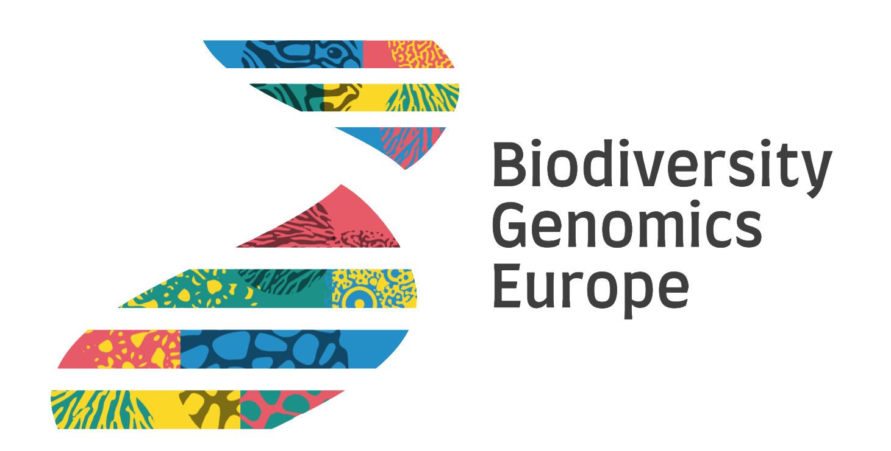

.. |chfund| image:: _static/ch-logo-200x50.png
  :width: 210
  :alt: Alternative text

.. raw:: html

    

.. role:: red

|logo_BGE_alpha|

BIOSCAN workflow v0.1b [December 2023]
**************************************

Draft of this workflow documentaion

____________________________________

|eufund| |chfund| |ukrifund|
