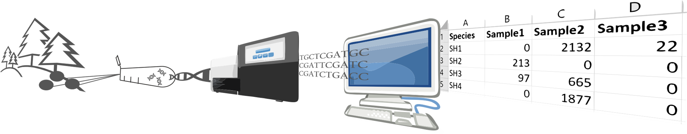

.. |logo_BGE_alpha| image:: _static/logo_BGE_alpha.png
  :width: 400
  :alt: Alternative text
  :target: https://biodiversitygenomics.eu/

.. |eufund| image:: _static/eu_co-funded.png
  :width: 220
  :alt: Alternative text

.. |chfund| image:: _static/ch-logo-200x50.png
  :width: 210
  :alt: Alternative text

.. |ukrifund| image:: _static/ukri-logo-200x59.png
  :width: 150
  :alt: Alternative text

.. raw:: html

    

.. role:: red

|logo_BGE_alpha|

BIOSCAN biomonitoring workflow
******************************

|mbwf|
*Draft workflow illustration*

| :red:`The documentation for the development of BIOSCAN biomonitorig workflow` 
| withing the framework of `Biodiversity Genomics Europe <https://biodiversitygenomics.eu/>`_ (BGE). 
| :red:`This is work in progress...`

.. |under_construction| image:: _static/under_construction.png
  :width: 250
  :alt: Alternative text

|under_construction|

.. grid:: 2

    .. grid-item-card:: :material-regular:`library_books;3em`
        :text-align: center
        :link: 6bioinfo.html

        **6bioinfo**

        Reading and analysing DNA and protein sequences

    .. grid-item-card::  :material-regular:`location_searching;3em`
        :text-align: center
        :link: 6bioinfo_COI.html

        **6bioinfo_COI**

        Analysing sequence patterns such as kmers, minimzers and motifs

Contents
========

.. toctree::
   :maxdepth: 2

   1sampling
   2sample_prep
   3DNA_extraction
   4amplicon_lib
   5sequencing
   6bioinfo
   7interpret
   8additional_resources
   changelog

____________________________________________________

|eufund| |chfund| |ukrifund|
